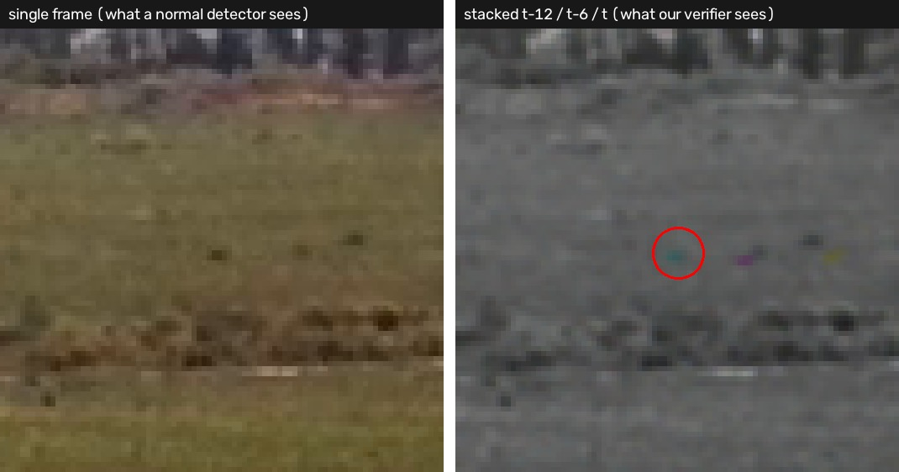
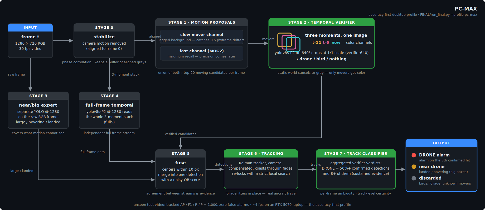
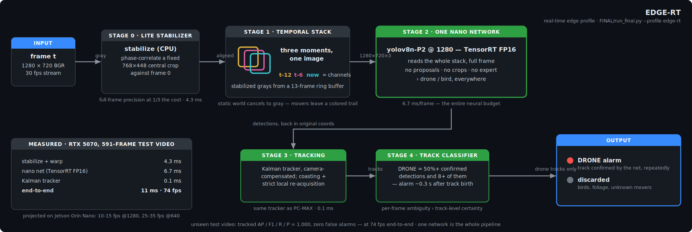
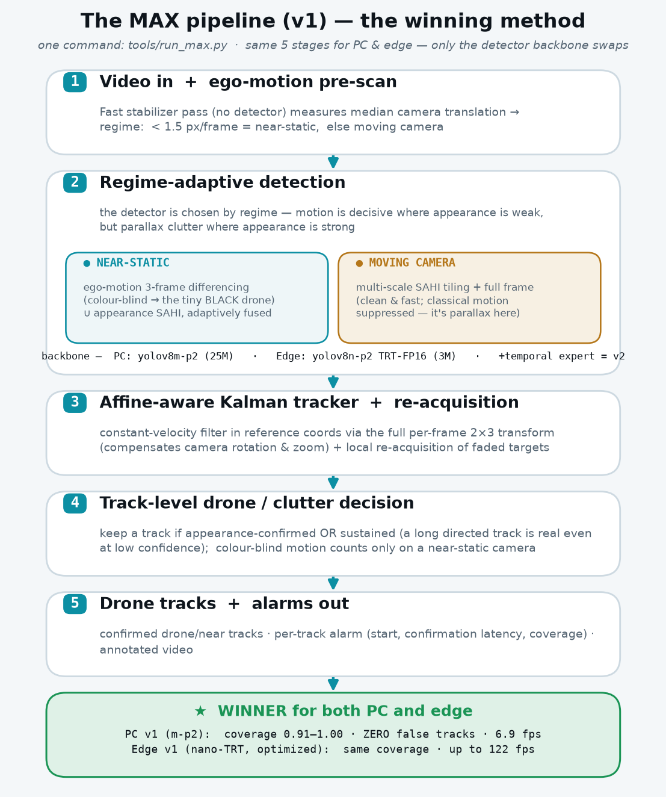
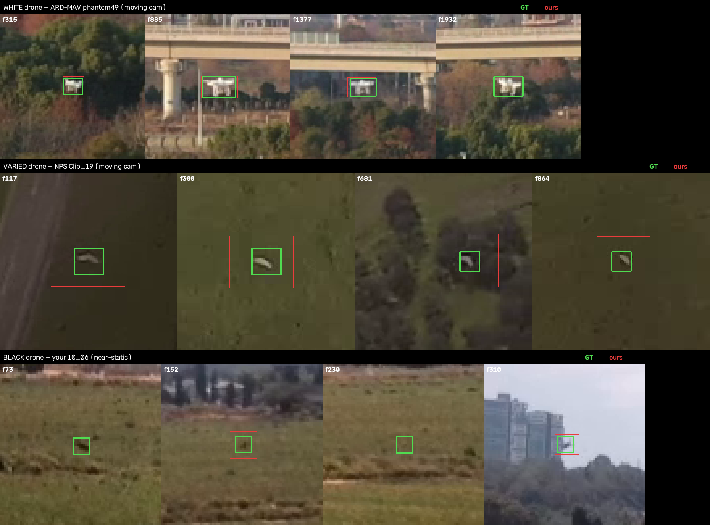
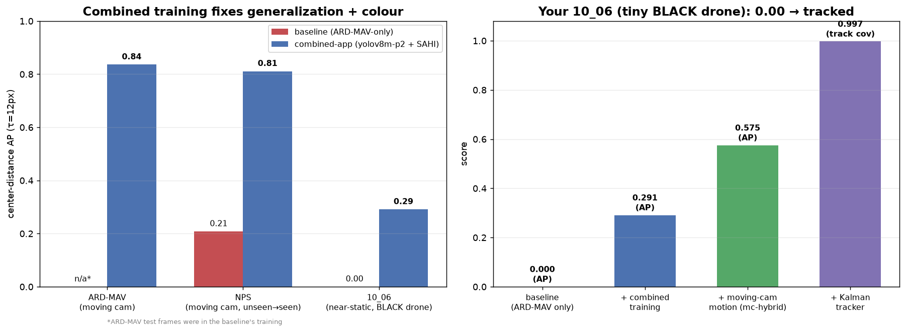

# HiveLab — Tiny-Drone Detection & Tracking

Detect and track a drone that occupies **3–14 pixels** in 720p RGB video — including long stretches where it is so low-contrast against field clutter that a *human* can only find it by flipping between frames. The camera itself is on a (slightly drifting) drone, so the whole world moves too.

<p align="center">
  
  <br/>
  <em><b>PC-MAX</b>, our best model, on the full-length test video it was never trained on (<code>10_06.mp4</code>, played 2×): the drone's early exit pass, then the whole return flight from the low-contrast field crossing up into the sky climb — flight trail, live zoom inset, zero false alarms.</em>
</p>

> **New here?** Jump to → [**what each algorithm is & how it works**](docs/guides/methods.md) · [**run our models on your video**](docs/guides/run-inference.md) · [**retrain / relabel**](docs/guides/retrain.md) · [**all documentation**](docs/README.md)

---

## Headline results

We ship **two models**, both scored on the **unseen** test video `10_06.mp4` (never trained on, never used for model selection). Matching is by **center distance** (τ = 12 px) — IoU is meaningless at 4 px.

| model | what it is | 07_05 val (hardest) | 07_05 full | **10_06 test (unseen)** | fps (RTX 5070) |
|---|---|---|---|---|---|
| **PC-MAX** | 3-stream fusion + tracker + track classifier (desktop GPU) | **AP/F1 1.000** | **1.000** | **1.000** | 4 |
| **EDGE-RT** | one YOLOv8-nano on the temporal stack, TensorRT FP16 | **1.000** | 0.996 / 0.998 | **1.000** | **74** |

Every labeled frame of both videos is hit within 12 px with **zero false positives** — PC-MAX misses at most 1 labeled frame in 885; the edge nano misses none on the test video and only a couple on the full training video. Per-frame detection (no tracker) tops out at AP ≈ 0.9; the last mile is temporal — track integration plus track-level confirmation (a drone is announced after 8 verifier-confirmed detections, ~0.25 s for PC-MAX / ~0.3 s for the edge nano).

**Versus a strong conventional baseline** on the same unseen video — a YOLO26n trained on a real multi-scene drone dataset (imgsz 1760, 300 epochs):

<p align="center">
  
</p>

| | flight coverage | where it works |
|---|---|---|
| Baseline YOLO26n (single frame) | **12.5%** | only the final second, drone against open sky (excellent there: conf 0.6–0.84, zero FPs) |
| HiveLab pipeline | **continuous track** | the whole flight, including 300 frames of ground clutter where the baseline outputs nothing even at conf 0.02 |

That gap **is** the thesis: single-frame appearance handles sky silhouettes; everything below the treeline requires **motion**.

---

## The core idea in one picture

A drone crossing a field at 4–10 px is invisible in a single frame — to a detector *and* to a human. But stabilize the video, then stack three grayscale frames (t−12, t−6, t) as the R/G/B channels of one image: everything static cancels to gray, and anything that moved appears as colored blips — one per moment in time.

<p align="center">
  
  <br/>
  <em>Same spot, same moment, unseen video. Left: find the drone (you can't — nor can any single-frame detector, at any confidence). Right: the detector's actual input — <b>yellow</b> = where the drone was 12 frames ago, <b>magenta</b> = 6 ago, <b>cyan</b> (circled) = now. The trail even shows its direction of flight.</em>
</p>

On identical held-out instances with an identical training recipe, **single-frame input → mAP50 0.06, temporal input → mAP50 0.83**. The representation, not the network, is the breakthrough. (It formalizes exactly how our human labeler found the drone: flip frames, watch what moves.)

---

## The two shipped models

Full walkthrough of every stage and every method variant: **[docs/guides/methods.md](docs/guides/methods.md)**. Deliverable details and weights: **[final/README.md](final/README.md)**.

### PC-MAX — most accurate (desktop GPU)

Three complementary detection streams (temporal motion verifier · full-frame temporal detector · full-frame expert for the landed/hovering drone) fused by center-agreement, then a Kalman tracker and a **track-level classifier** that turns per-frame scores into a decision — a track is announced as a drone at its 8th verifier-confirmed detection (~0.25 s after track birth).

<p align="center">
  
</p>

### EDGE-RT — real-time (edge hardware)

The whole pipeline distilled into a **single YOLOv8-nano-P2** reading the stabilized 3-moment stack full-frame — no proposals, no crops, no expert — under TensorRT FP16, with the same tracker and track classifier behind it. One network *is* the pipeline, at **~74 fps end-to-end** through the shipped runner (the lean edge runner reaches ~85). See **[realtime/README.md](realtime/README.md)** for the edge story (six pipelines compared, bottleneck log, Jetson projections).

<p align="center">
  
</p>

---

## Generalist upgrade — the MAX pipeline (any dataset · any colour · moving camera)

The two models above are near-perfect on their one location. The limitation they left open —
*"new scenes, drone types, and strong camera motion"* — is exactly what this block closes. We
pulled in **public tiny-drone datasets** ([ARD-MAV](https://github.com/WindyLab/Global-Local-MAV-Detection) + [NPS-Drones](https://engineering.purdue.edu/~bouman/UAV_Dataset/), air-to-air, *moving* cameras), merged them
with our own footage into **one combined training set**, and built a **regime-adaptive pipeline**
that leans on the video (motion + tracking) to work across datasets, drone **colours**, and a
flying camera. One command (`tools/run_max.py`), with a **winning build per hardware target**:

<p align="center">
  
</p>

**End-to-end tracked** on held-out clips spanning both camera regimes (coverage = fraction of GT
frames tracked; τ = 12 px center-distance):

| build | 10_06 (black, near-static) | ARD-MAV (moving) | NPS (moving) | false tracks | black-drone det AP | fps |
|---|---|---|---|---|---|---|
| **PC v1** · `yolov8m-p2` | **1.000** | 0.993 | 0.914 | **0** | 0.518 | 6.9 |
| PC v2 · + temporal expert | 1.000 | 0.999 | 0.914 | 2–3 | **0.690** | 4.3 |
| **Edge v1** · `yolov8n-p2` + TensorRT | **1.000** | 1.000 | 0.906 | 0–6 | 0.465 | **107–122** ᵒᵖᵗ |
| Edge v2 · + temporal expert | 1.000 | 1.000 | 0.906 | 1–6 | 0.561 | 10.0 |

- **PC winner → v1** — highest coverage, **zero false tracks**, ~1.6× faster than v2.
- **Edge winner → v1** — same coverage, real-time. Profiled + optimized (full-frame TRT +
  ½-res stabiliser + detect-every-2nd-frame) from 20 → **107–122 fps** on moving cameras and
  14 → **33 fps** on the near-static black-drone path, **with zero accuracy loss** — [how](docs/reports/round6-max-pipeline.md#edge-v1-speed--profile-then-attack-the-bottleneck-1420-fps--33122-fps).
- The temporal ensemble (v2) is the strongest *detector* (black-drone AP **0.52 → 0.69**) but the
  tracker already saturates coverage, so it only buys false tracks — [full analysis](docs/reports/round6-max-pipeline.md).

**Colour invariance** — one model finds white, varied **and black** drones (it was blind to the
black drone before combined training). Green = ground truth, red = ours:

<p align="center">
  
</p>

**The generalization + colour jump** — combined training takes NPS from 0.21 → 0.81 and the black
drone in `10_06` from **0.00 → tracked**:

<p align="center">
  
</p>

Full story: [round 4 — datasets & generalization](docs/reports/round4-external-datasets.md) ·
[round 5 — moving camera, colour/scale & edge](docs/reports/round5-moving-camera-multidataset.md) ·
[round 6 — the unified MAX pipeline](docs/reports/round6-max-pipeline.md).

```bash
# run the generalist pipeline on any video (PC: default weights; edge: pass the nano weights)
python tools/run_max.py --profile v1 --weights work/runs/combined-m-p2-640/weights/best.pt \
    --video your_video.mp4 --out out_max
```

---

## Showcase videos

All full-length runs on the unseen test video (the source files hide their opening seconds behind an MP4 edit list — [`tools/recover_full_video.py`](tools/recover_full_video.py) recovers them losslessly; `10_06.mp4` is really 591 frames / 19.7 s, not 361).

- ▶ [**Side-by-side — Baseline | PC-MAX | EDGE-RT**](docs/media/10_06_baseline_vs_pcmax_vs_edgert.mp4) — the money shot
- ▶ [PC-MAX on the test video](docs/media/10_06_pcmax_tracks.mp4) · ▶ [EDGE-RT on the test video](docs/media/10_06_edgert_tracks.mp4) · ▶ [baseline on the same video](docs/media/10_06_baseline_dets.mp4)
- ▶ [training video with hand labels painted](docs/media/07_05_round2_tracks.mp4)

---

## Quickstart

```bash
pip install -r requirements.txt          # torch needs the cu128 index on Blackwell GPUs — see requirements.txt

# run either shipped model on any video
python final/run_final.py --video your_video.mp4 --profile pc-max  --out out_pc     # most accurate
python final/run_final.py --video your_video.mp4 --profile edge-rt --out out_edge    # real-time
```

Outputs land in `--out`: `annotated.mp4` (classified tracks painted), `tracks_drone.json` (confirmed drone tracks), `alarms.txt` (per drone track: span, coverage, confirmation latency), and per-frame `dets.json`. Full guide, including the research pipeline and the baseline-comparison tool: **[docs/guides/run-inference.md](docs/guides/run-inference.md)**.

---

## Repository layout

```
data/videos/          the two source videos (07_05 = train, 10_06 = unseen test)
dronedet/             the core pipeline library
  stabilize.py          global camera-motion estimation
  motion.py             background-model motion detector (lag, MAD noise, flicker map)
  methods/              every detection method behind one interface (build_method registry)
    hybrid2.py            the flagship: dual proposals + temporal verifier + expert
  track.py              Kalman tracker + re-acquisition + kinematic filters
  trackclass.py         track-level drone/clutter classifier (aggregated verifier confidence)
  evaluate.py           center-distance evaluation (AP / F1 / per-object recall)
  cli.py                python -m dronedet {detect,eval,track,render}
realtime/             the edge (Jetson-class) re-architecture — see realtime/README.md
final/                the two shipped models + one-command runner — see final/README.md
  pc_max/  edge_rt/      final weights per profile
  run_final.py
tools/                dataset builders, training, labeling UI, reproduction scripts
work/                 experiment artifacts: ground truth, trained weights, detections, tracks
  gt_user.json          authoritative hand-labeled GT for 07_05
  models/               all trained weights (see docs/guides/methods.md § weights)
baseline/             external baseline weights (YOLO26n)
docs/                 reports, guides, reference surveys, media  →  docs/README.md
```

A map of **which weight file is what** lives in [docs/guides/methods.md § Weights](docs/guides/methods.md#weights).

---

## Documentation

| doc | what's in it |
|---|---|
| [docs/guides/methods.md](docs/guides/methods.md) | **every algorithm** — full pipeline, models in each, and measured performance |
| [docs/guides/run-inference.md](docs/guides/run-inference.md) | run our models (or the baseline) on a new video |
| [docs/guides/retrain.md](docs/guides/retrain.md) | relabel a clip, rebuild datasets, retrain, reproduce a round |
| [final/README.md](final/README.md) · [realtime/README.md](realtime/README.md) | the two deliverables · the edge pipeline in depth |
| [docs/reports/](docs/reports/) | the build story — single-scene ([round 1](docs/reports/round1-pipeline.md) · [2](docs/reports/round2-results.md) · [3](docs/reports/round3-deliverables.md)) then generalist ([4 — datasets](docs/reports/round4-external-datasets.md) · [5 — moving camera & edge](docs/reports/round5-moving-camera-multidataset.md) · [6 — MAX pipeline](docs/reports/round6-max-pipeline.md)) |
| [docs/references/](docs/references/) | the tiny-object-detection research surveys that drove the design |

---

## Honest limitations & next steps

- **New scenes / drone types / moving cameras — now addressed** by the [MAX pipeline](#generalist-upgrade--the-max-pipeline-any-dataset--any-colour--moving-camera) (combined multi-dataset training + regime-adaptive fusion + an affine-aware tracker). The remaining gap is *moving-camera datasets we never trained on* — public data closes most of it but in-domain footage still wins the last points.
- **Drone-vs-bird is the frontier.** At a few pixels, motion cannot separate a bird from a drone — only appearance can, and appearance is exactly what's weakest at that scale. It's why the temporal ensemble's extra recall (round 6) turns into bird false-tracks. A learned drone-vs-bird *track* classifier (appearance + kinematics + flap signature over the whole track) is the single next lever.
- Production fine-tune checklist (evidence-based, see the [reports](docs/reports/)): temporal input channels first, NWD/RFLA assignment for tiny boxes, copy-paste with scale + haze + trajectory jitter, scale-separated experts, and center-distance evaluation — never bare mAP@0.5.
