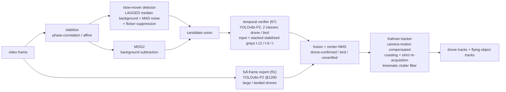

# HiveLab — Tiny-Drone Detection & Tracking

Detecting and tracking a drone that occupies **3–14 pixels** in 720p RGB video — including long stretches where it is so low-contrast against field clutter that a *human* can only find it by flipping between frames.

<p align="center">
  
  <br/>
  <em>The full pipeline on a video it was never trained on (<code>10_06.mp4</code>): one continuous track (id1) from the low-contrast field crossing to the sky climb — flight trail, live zoom inset, no false alarms.</em>
</p>

## Headline results

**Held-out evaluation** (hand-labeled ground truth; the val segment is a 4–10 px drone drifting over bushes at ~0.5 px/frame — the hardest regime):

| method | AP | best F1 | Recall | Precision | FP/frame |
|---|---|---|---|---|---|
| **HiveLab: pipeline + track integration** (`tracked-moe3`) | **0.960** | **0.938** | **1.000** | 0.884 | 0.13 |
| HiveLab: per-frame (`moe3-stacked`) | 0.656 | 0.760 | 0.767 | 0.752 | 0.25 |
| same pipeline, single-frame verifier (ablation) | 0.222 | 0.316 | 0.558 | 0.220 | 1.98 |
| plain fine-tuned YOLO (best of 5 recipes) | 0.023 | 0.060 | 0.049 | — | 0.57 |
| pretrained YOLO — every variant (640/1280/SAHI) | ≈ 0.000 | ≤ 0.001 | ≤ 0.005 | — | — |

**Tracking**: the drone's entire 548-frame flight — descent, bush-skim, fast dash, slow drift — is covered as **one track: 97.1% coverage, zero ID switches, 1.0 px median error**.

**Against a strong conventional baseline** on the unseen video — YOLO26n trained on a real multi-scene drone dataset (imgsz 1760, 300 epochs):

<p align="center">
  
</p>

| | flight coverage | where it works |
|---|---|---|
| Baseline YOLO26n (single frame) | **12.5%** | only the final second, drone against open sky (excellent there: conf 0.6–0.84, zero FPs) |
| HiveLab pipeline | **continuous track** | the whole flight, including 300 frames of ground clutter where the baseline outputs nothing even at conf 0.02 |

That gap **is** the thesis: single-frame appearance handles sky silhouettes; everything below the treeline requires motion.

Videos: [pipeline on unseen video](docs/media/10_06_tracks_confirmed.mp4) · [baseline on the same video](docs/media/10_06_baseline_dets.mp4) · [training video with hand labels painted](docs/media/07_05_round2_tracks.mp4)

---

## The method



Every stage exists because a simpler version measurably failed:

1. **Stabilization** — all motion reasoning happens in a fixed reference frame (translation via phase correlation; LK+RANSAC affine available for stronger ego-motion).
2. **Slow-mover motion proposals** — background subtraction with a **lagged background** (built only from frames ≥ 90 old): a drone drifting at 0.5 px/frame has moved 45+ px out of its own background model instead of being absorbed by it. A per-pixel noise model (median-absolute-deviation) and a **flicker map** (chronic movers raise their own local threshold) suppress wind-blown foliage, which oscillates in place, while a transiting drone passes. Unioned with MOG2 for maximum recall — precision is the next stage's job.
3. **Temporal verification — the key idea.** Each candidate gets a 640×640 native-resolution crop whose three channels are **stabilized grayscale frames at t−12, t−6, t**. Static scenery cancels to gray; anything moving leaves a color-fringed trail. A 2-class (drone/bird) YOLOv8s-P2 trained on this representation reaches **mAP50 0.83** on real held-out instances where the *identical* single-frame model reaches **0.06**. This is the observation a human labeler makes ("I could only find it by flipping frames") turned into the model's input.
4. **Full-frame expert** — a separate YOLOv8s-P2 covers what motion can't see: large, hovering, or landed drones.
5. **Tracking** — constant-velocity Kalman in stabilized coordinates, Hungarian association by center distance (appearance is meaningless at 4 px), coasting through fades, **strict local re-acquisition** (unique-peak test in a short-term background difference — a loose version latches onto foliage), and a **kinematic clutter filter**: foliage jitter is zero-mean, flying objects sustain direction; appearance-confirmed tracks (a landed drone) are exempt.
6. **Track classification** — drone-confirmed tracks (verifier agrees repeatedly) become alarms; directed-but-unconfirmed movers surface as "flying object" (birds); everything else never surfaces.

Training the tiny verifier has its own recipe (labels inflated to fixed 24 px boxes, copy-paste augmentation with multi-scale + atmospheric-haze jitter + simulated per-channel motion, and **never mixing large and sub-10 px instances in one training mix** — the large object's alignment scores starve the tiny ones to exactly zero recall). The full failure-mode investigation is in [REPORT.md](REPORT.md) §"training saga" and [REPORT2.md](REPORT2.md).

---

## What's in the project

Two full experiment rounds, 19 evaluated method variants, 7 trained models, a labeling tool, and an evaluation harness built for few-pixel targets (center-distance matching — IoU is meaningless at 4 px).

### Reports

- **[REPORT2.md](REPORT2.md)** — the definitive results: evaluation against hand labels, the temporal-vs-single-frame ablation, the slow-mover fix, SR ablation, bird handling.
- **[REPORT.md](REPORT.md)** — round 1: building the pipeline, the resolution/SAHI/motion comparisons, and the tiny-object training failure analysis (why plain fine-tuning gets 0.000 recall on <10 px targets and what fixes it).

Notable negative results (measured, not assumed): image super-resolution on crops (FSRCNN ×4 vs bicubic: no meaningful gain), plain fine-tuning at any resolution/slicing without the tiny-object recipe, and semi-automatic ground truth (our auto-GT confidently tracked a *bird* for 234 frames — the manual labels corrected it).

### Repository layout

```
dronedet/               the pipeline library
  stabilize.py            global camera-motion estimation
  motion.py               background-model motion detector (lag, MAD noise, flicker map)
  methods/                all detection methods behind one interface
    hybrid2.py              the best pipeline (dual proposals + temporal verifier + expert)
    hybrid.py, yolo.py, motion_only.py, ...
  track.py                Kalman tracker + re-acquisition + track filters
  evaluate.py             center-distance evaluation (AP / F1 / per-object recall)
  render.py, viz.py       annotated video rendering
  cli.py                  python -m dronedet {detect,eval,track,render}
tools/
  run_best.py             one-command inference on any video  <-- start here
  run_baseline.py         same visualization for any plain detector
  label.py                browser labeling UI (wheel-zoom, per-frame autosave)
  build_gt_user.py        manual labels -> canonical GT + agreement analysis
  make_dataset_ft6/ft7.py training-set builders (single-frame / temporal)
  train_yolo.py           training recipe (P2 head, tiny-object settings)
  final_round2.py         reproduce the full round-2 comparison
work/
  gt_user.json            ground truth (from manual labels) - authoritative
  models/                 all trained weights (ft1 expert, ft7 temporal verifier, ...)
  eval_user_*.md          method-comparison tables
  det*/ tracks*/ infer/   per-method detections, tracks, inference outputs
baseline/                 external baseline weights (YOLO26n)
```

### Run inference on any video

```bash
pip install -r requirements.txt   # torch needs the cu128 index on Blackwell GPUs
python tools/run_best.py --video your_video.mp4
```

Outputs in `work/infer/<video>/`: `tracks_confirmed.mp4` (drone alarms only), `tracks_all.mp4` (every flying object), `dets.mp4` (raw detections), JSONs, and a per-track summary that attributes each track to *drone* or *unconfirmed flying object*. Track labels: solid `id1` = detected this frame; `id1?` (yellow) = coasted/re-acquired estimate.

Baseline comparison for any plain detector:

```bash
python tools/run_baseline.py --weights baseline/yolo26n-new-data_full__2026_Jan_19.pt --video your_video.mp4
```

### Evaluate / retrain / relabel

```bash
# score any detection JSONs against the GT (val split = frames 342+)
python -m dronedet eval --gt work/gt_user.json --dets work/det2/*.json --frames 342:571

# label a new video (browser UI), then canonicalize
python tools/label.py                      # -> work/labels.json
python tools/build_gt_user.py              # -> work/gt_user.json + agreement stats

# retrain the temporal verifier and reproduce the full comparison
python tools/make_dataset_ft7.py
python tools/train_yolo.py --data work/dataset_ft7/data.yaml --imgsz 640 --batch 16 --name ft7-p2-640-stacked
python tools/final_round2.py
```

### Honest limitations & next steps

- Trained/validated on footage from one location (train/val split is by time, and the pipeline held up on a different-day unseen video — but new scenes, drone types, and strong camera motion need the planned heavy fine-tune).
- At 4 px, birds and drones genuinely converge: two bird tracks still pick up occasional drone confirmations. Next step: a track-level classifier on kinematics + appearance across the whole track (flap signature).
- Production fine-tune checklist (evidence-based, see reports): temporal input channels first, NWD/RFLA assignment for tiny boxes, copy-paste with scale+haze+trajectory jitter, scale-separated experts, and center-distance evaluation — never bare mAP@0.5.
