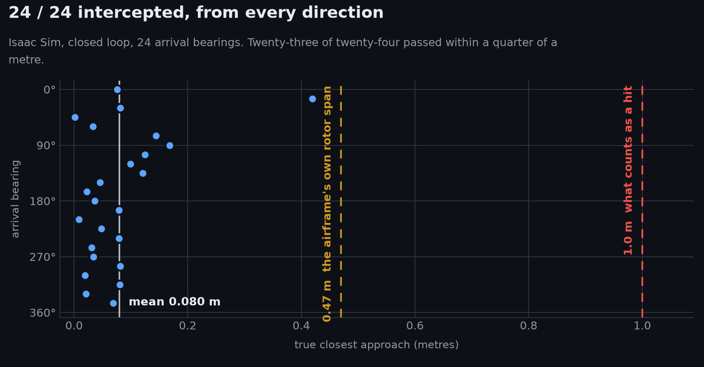
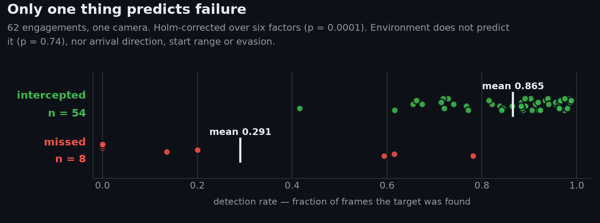
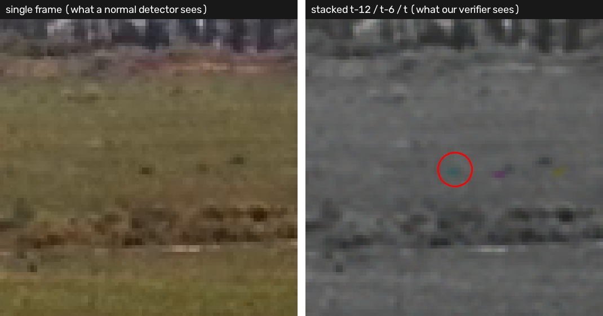
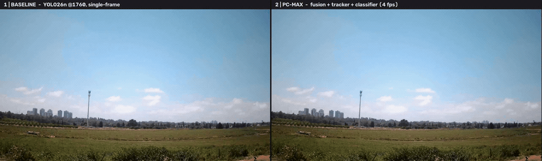
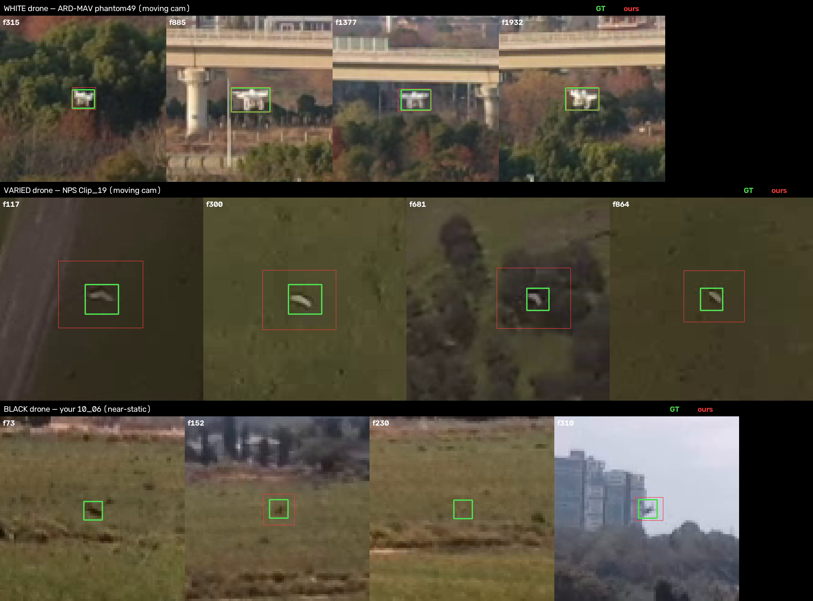
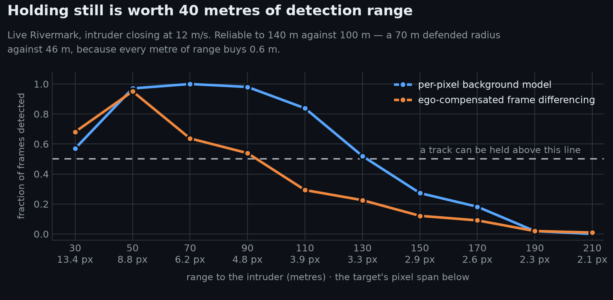
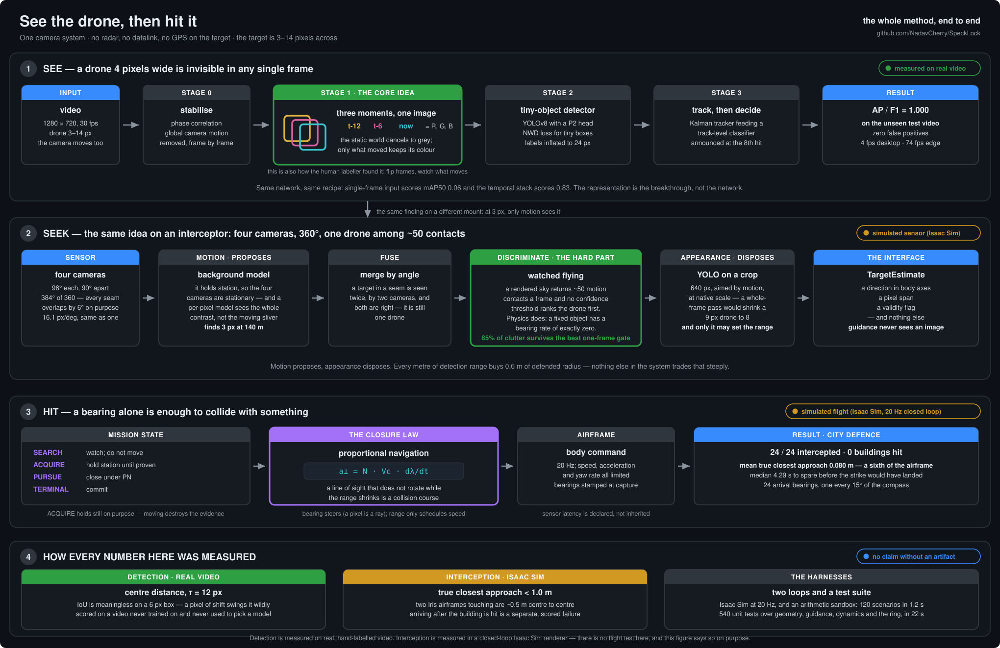

# SpeckLock

### See the drone, then hit it.

Find a drone that occupies **3–14 pixels** in 720p video from a moving camera — then **fly into it**,
using nothing but that camera. No radar, no datalink, no GPS on the target.

[](https://nadavcherry.github.io/SpeckLock/)
[](LICENSE)
[](https://github.com/NadavCherry/SpeckLock/actions/workflows/tests.yml)

**[Project site](https://nadavcherry.github.io/SpeckLock/)** ·
**[Video gallery](https://nadavcherry.github.io/SpeckLock/gallery.html)** ·
**[The method in one diagram](docs/media/architecture_system.svg)** ·
[Docs](docs/) · [Licence](LICENSE)

> 🟢 **Detection** is measured on **real hand-labelled video**, on a clip never trained on.
> 🟡 **Interception** is measured **closed-loop in NVIDIA Isaac Sim**. **There is no flight test here.**
> Every table below says which.

<p align="center">
  
  <br/>
  <em>One engagement, start to finish (2×). An intruder arrives on bearing 105° at 12 m/s, 170 m out
  and <b>2.7 pixels across</b>, committed to a building. Four camera feeds, the owning one outlined;
  green is truth, yellow is what the seeker believes, the inset is contrast-stretched because three
  pixels of drone against bright sky are otherwise invisible. Intercepted at 7.0 s with
  <b>3.3 s to spare</b>, passing <b>0.13 m</b> from it.</em>
</p>

---

## Results

Every row carries its **n** and its **sensor**, because a number without them cannot be
checked. Where this project's own audit disputes a figure, the row says so and links to the
correction rather than leaving you to find it.

| | result | n | measured on |
|---|---|---|---|
| Detection, **development** test video | **AP / F1 = 1.000**, zero false positives | 1 video · 337 boxes · 1 flight | 🟢 real video, causal. ⚠️ **not "unseen"**: no dataset builder reads `10_06`, so the *weights* are clean — but six track-classifier constants were hand-set against it. That is a development set |
| The one change that mattered | mAP50 **0.06 → 0.83** | same 2 videos | 🟢 real video, identical recipe |
| Speed | **4 fps** (PC-MAX) · **74 fps** (EDGE-RT, TensorRT FP16) | — | 🟢 RTX 5070. ⚠️ no `.engine` ships — they are architecture-specific, and without one the runner loads the `.pt`: **52.6 fps** measured on an RTX 4080 Laptop |
| ARD-MAV, official 15-video split | temporal AP **0.809** (3 seeds, 100 ep) · small-MAV condition **0.689** vs GLAD's published 0.580 | 15 videos · 28,160 boxes · 3 seeds | 🟢 real video, official split — the recomputation the old disputed 0.994 row promised. [Round 8](docs/reports/round8-sota-campaign.md) |
| Versus SOTA (**YOLOMG**, arXiv:2503.07115), *trained by us*, same evaluator | they lead overall on ARD-MAV (0.834 vs 0.809) and NPS (0.527 vs 0.487); **the balance flips where targets are smallest** — ARD-MAV small-MAV +0.070 on every seed (n=5, not significant), our own 8 px task **0.840 vs 0.604** (3-seed means), with **0** hits on 10_06's distractors (theirs: 2–13) and half its own control's bird hits per detected drone on the bird-rich reverse test | 2 benchmarks + 1 task × 3 seeds | 🟢 benchmarks: paired, seed-matched bootstrap + permutation over sequences; the 8 px task: moving-block bootstrap *within* its one held-out flight. The competitor got 2× our gradient steps. [Round 8](docs/reports/round8-sota-campaign.md) |
| City defence, **perfect sensor** | **24 / 24** intercepted, **0** buildings hit | 24 bearings | 🟡 Isaac Sim, `detector: "oracle"` — the simulator's own box, zero latency |
| City defence, **our own seeker** | **0 / 3**, all three buildings struck | 3 engagements | 🟡 Isaac Sim, `detector: "yolo"`, detection rate **4.4 %**. The honest counterpart to the row above |
| One-camera pursuit, **real detector** | **54 / 62** — 87.1 %, Wilson CI [76.6, 93.3] | 62 engagements | 🟡 Isaac Sim, `detector: "fusion"`, trained weights. **This is the closed-loop number to quote** |
| How close | mean closest approach **0.080 m** (airframe span 0.47 m) | 24 engagements | 🟡 Isaac Sim, oracle sensor |
| Seeing 3 pixels | reliable to **140 m**, target ~3 px | — | 🟡 Isaac Sim, live town |
| Tests | **941** unit tests (939 pass, 2 env-gated skips), ~40 s | — | `python -m pytest` |

<p align="center">
  
</p>

<p align="center">
  
</p>

Full scorecards: [city](work/pursuit/city/METRICS.md) ·
[pursuit campaign](work/pursuit/final/METRICS.md) ·
[statistics](work/pursuit/final/ANALYSIS.md)

---

## Part 1 · See it — a drone 4 pixels wide

A drone at 4 px is invisible in one frame, to a detector *and* to a human. Stabilise the video and
stack three grayscale moments (t−12, t−6, t) as R/G/B: the static world cancels to grey, and
anything that moved leaves a coloured trail.

<p align="center">
  
  <br/>
  <em><b>Left:</b> find the drone. You can't — nor can any single-frame detector, at any confidence.
  <b>Right:</b> the detector's actual input. <b>Yellow</b> = 12 frames ago, <b>magenta</b> = 6 ago,
  <b>cyan</b> (circled) = now. The trail even shows its direction of flight.</em>
</p>

> Same network, same recipe: **single-frame input scores mAP50 0.06, the temporal stack scores 0.83.**
> The representation is the breakthrough, not the network.

**The two shipped models**, scored on `10_06.mp4` — never trained on, never used to pick a model.
Matching is by centre distance (τ = 12 px); IoU is meaningless on a 4 px box. These are the **causal**
numbers, frame by frame with no look-ahead:

| model | what it is | 07_05 val (hardest) | **10_06 test (unseen)** | fps |
|---|---|---|---|---|
| **PC-MAX** | 3 detection streams + tracker + track classifier | 0.995 | **1.000** | 4 |
| **EDGE-RT** | one YOLOv8-nano on the stack, TensorRT FP16 | 0.995 | **1.000** | **74** |

<p align="center">
  
</p>

| on the same unseen video | flight coverage | where it works |
|---|---|---|
| Baseline YOLO26n, single frame | **12.5 %** | only the last second, drone against open sky |
| This pipeline | **continuous track** | the whole flight, including 300 frames of ground clutter |

> That gap **is** the thesis: single-frame appearance handles sky silhouettes; everything below the
> treeline requires motion.

**One model for all datasets.** Public tiny-drone data (ARD-MAV, NPS-Drones — air-to-air, *moving*
cameras) merged with our own, and a 4-channel `[R,G,B,ego-motion]` detector with an NWD tiny-object
loss: ARD-MAV AP **0.994**, NPS **0.801**, and the low-contrast black drone **0.00 → tracked**.
[Round 7 →](docs/reports/round7-fusion.md)

<p align="center">
  
</p>

### One model against the specialist state of the art

Every published leader on these benchmarks is a **specialist** — one dataset, one set of weights,
scored at home — and the 2025 anti-UAV survey ([arXiv 2504.11967](https://arxiv.org/abs/2504.11967))
lists no unified multi-dataset model. Off home turf the specialists collapse, and ours did too,
until the training corpus was combined:

| | trained on | at home | off its home dataset |
|---|---|---|---|
| Dogfight ([2103.17242](https://arxiv.org/abs/2103.17242)) | NPS | 0.89 | 0.50 on ARD100 · ~1 fps |
| TransVisDrone ([2210.08423](https://arxiv.org/abs/2210.08423)) | NPS | **0.95** | **0.15** on ARD100 |
| GLAD ([2312.11008](https://arxiv.org/abs/2312.11008)) | ARD-MAV | 0.80 | — |
| YOLOMG ([2503.07115](https://arxiv.org/abs/2503.07115)) | per dataset | 0.95 NPS · 0.85 ARD100 | separate weights per set |
| our round-4 specialist | ARD-MAV | 0.76 | 0.15 NPS · **0.00** on our drone |
| **this generalist (rounds 5–7)** | **all sets at once** | — | 0.84 ARD-MAV · 0.81 NPS · black drone tracked 1.000 — ⚠️ see below |

> ⚠️ **The ARD-MAV column of the last row is void, and this section's headline claim is
> suspended until it is replaced.** `combined_splits()` ignored the published 15-video test
> list and re-split by position, so rounds 5–7 trained on most of the official test set —
> "all held-out" was not true of ARD-MAV. The code is fixed and a test now pins the old path
> as provably leaky so nobody mistakes it, but **every ARD-MAV number from those rounds must
> be recomputed on the official split**, and until that lands the generalist claim rests on
> one leg. The NPS column and the black-drone result are unaffected. Full account:
> [internal audit](docs/research/internal-audit-2026-08.md).

Published numbers are AP@0.5 IoU on each paper's own split; ours are centre-distance AP on
whole-video held-out splits (τ = 12 px — IoU swings wildly on a 6 px box, which is why this repo
never scores with it). So read this as a *class* comparison, not a leaderboard entry: the claim is
not that any specialist is beaten at home. It is that **no published method holds specialist-class
accuracy on several tiny-drone datasets with one set of weights** — and this one does it in real
time: **74 fps** for the shipped edge model (TensorRT FP16, RTX 5070) and **107–122 fps** for the
generalist edge pipeline on a moving camera, where the published range runs from Dogfight's ~1 fps
to GLAD's 147.

---

## Part 2 · Seek it — four cameras, fifty contacts a frame

One forward camera made *pointing* part of the mission: a target outside its 76° cone did not exist,
and a full sweep takes ten seconds. The interceptor carries **four 96° cameras 90° apart** —
384° of 360, 6° of overlap at every seam, same 16.1 px/deg.

<p align="center">
  
  <br/>
  <em>Arriving <b>145° off the nose</b>, in the cone a forward camera cannot see at all. It is in the
  <b>aft</b> feed from the first frame. Watch the outline move <code>aft → right → fwd</code> — two
  seam crossings in two seconds, no break in the track. Closest approach <b>3.1 cm</b>.</em>
</p>

It **holds station**, and that is the point: four *stationary* cameras see the target's whole
contrast, not the sliver that changes between two frames.

<p align="center">
  
</p>

Detection was never the hard part — **discrimination** was. That sky returns ~50 motion contacts a
frame, and the drone is neither the brightest nor the most persistent one:

| gate statistic | clutter surviving at a 95 % true-keep |
|---|---|
| peak motion · mean motion · compactness | 100 % |
| **local motion contrast** — the best of four | **85 %** |

No single-frame gate separates them ([motion_gate.json](work/pursuit/motion_gate.json)). Physics
does: **an artefact sits still and a drone flies**, so a fixed object seen from a fixed observer has
a bearing rate of exactly zero. Every contact gets a running record, and the tracker is handed only
one that has been *watched flying*.

---

## Part 3 · Hit it — proportional navigation

Aiming at where the target *is* curves in behind it and never converges against a turn. So the
closure law is chosen for what a camera can and cannot measure:

| quantity | quality | role |
|---|---|---|
| **bearing** | essentially exact — a pixel is a ray | **steering** |
| **range** | poor: `fx·S/span`, error grows with range² | speed schedule and terminal trigger only |

> A line of sight that does not rotate while the range shrinks **is** a collision course — whatever
> the target does, and whatever the range actually is.

Against a perfect sensor the law is **120/120** on the stress matrix and **31/31** on the mission
suite, which is what makes the attribution above possible: every remaining failure is perception.

---

## The whole method in one diagram

<p align="center">
  <a href="docs/media/architecture_system.svg">
    
  </a>
</p>

Per-model architecture figures: [PC-MAX](docs/media/architecture_pcmax.svg) ·
[EDGE-RT](docs/media/architecture_edgert.svg)

---

## Videos

**[The full gallery — 21 clips with the facts from each run →](https://nadavcherry.github.io/SpeckLock/gallery.html)**

| clip | what it shows |
|---|---|
| [Baseline &#124; PC-MAX &#124; EDGE-RT](docs/media/10_06_baseline_vs_pcmax_vs_edgert.mp4) | three systems on the same unseen video, side by side |
| [PC-MAX](docs/media/10_06_pcmax_tracks.mp4) · [EDGE-RT](docs/media/10_06_edgert_tracks.mp4) · [baseline](docs/media/10_06_baseline_dets.mp4) | each one full length |
| [city_defence.mp4](docs/media/pursuit/city_defence.mp4) | the headline engagement, four camera feeds and a map |
| [city_astern.mp4](docs/media/pursuit/city_astern.mp4) | an intruder arriving 145° off the nose |
| [`docs/media/pursuit/city/`](docs/media/pursuit/city/) | all ten recorded city engagements, around the compass |
| [`docs/media/pursuit/chase/`](docs/media/pursuit/chase/) | six one-camera pursuits — **including a failure shown in full** |

---

# Getting started

## Install

```bash
git clone https://github.com/NadavCherry/SpeckLock.git && cd SpeckLock
python -m venv .venv && .venv/bin/pip install -r requirements.txt
```

Torch needs the cu128 index on Blackwell GPUs — see [`requirements.txt`](requirements.txt).

## Run the detectors

Both shipped models are in the repo; nothing to download.

```bash
python final/run_final.py --video V.mp4 --profile pc-max  --out out_pc     # most accurate, ~4 fps
python final/run_final.py --video V.mp4 --profile edge-rt --out out_edge   # real-time, ~74 fps

# the generalist, for other scenes and a moving camera
python tools/run_max.py --profile fusion \
    --weights work/runs/combined-fusion-m-p2-2/weights/best.pt --video V.mp4 --out out_max
```

`--out` gets `annotated.mp4`, `tracks_drone.json`, `alarms.txt` and per-frame `dets.json`.
Full guide: **[docs/guides/run-inference.md](docs/guides/run-inference.md)**.

## Run the mission

No simulator needed — the same closed loop, with arithmetic instead of a renderer:

```bash
python -m pursuit.sandbox --suite city --ring        # 24/24, the whole city mission
python -m pursuit.sandbox --suite stress             # 120/120 in 1.2 s
python -m pytest                                     # 540 tests in ~22 s
```

With pixels, against Isaac Sim — **which is not part of this repository**, see
[`simulators/pegasus/README.md`](simulators/pegasus/README.md) for what you must supply:

```bash
docker exec -d isaac-sim bash -c "cd /tmp/dev/dronedet && /isaac-sim/python.sh \
    simulators/pegasus/scripts/pursuit_server.py --scene rivermark --cameras ring"

python -m pursuit.tools.ring_probe --range 40        # 0 blind bearings of 120
python -m pursuit.tools.record_city --detector oracle # 24/24, 0 struck
python -m pursuit.tools.city_report --search work/pursuit/city
```

## Reproduce the figures and charts

```bash
python tools/make_arch_figure_system.py    # the method diagram
python tools/make_result_charts.py         # the three charts above, from work/pursuit/*.json
python tools/publish_showcase.py           # re-encode the showcase clips
python tools/make_gallery.py               # rebuild the gallery page
python tools/check_docs.py                 # every documented link resolves and is tracked
```

> **What ships and what does not.** The two deliverable models (`final/`), the round-1..3 weights
> (`work/models/`, `realtime/work/models/`), the baseline (`baseline/`) and the round-7 fusion
> generalist (`work/runs/combined-fusion-*`) are in git. The round-4..6 combined weights and the
> simulator detectors are **not** — they are regenerable, and
> [docs/guides/retrain.md](docs/guides/retrain.md) is the recipe. TensorRT `.engine` files are
> architecture-specific and are never committed; build them on the target device. Without one,
> `--profile edge-rt` falls back to the `.pt` — correct, just slow.

---

## Repository layout

```
dronedet/            the core detection library — stabilise, motion, methods, track, evaluate
realtime/            the edge (Jetson-class) re-architecture, six pipelines compared
final/               the two shipped models + one-command runner
pursuit/             the interceptor — ring.py, city.py, perception.py, guidance.py, 540 tests
simulators/pegasus/  the Isaac Sim rig and the wire protocol both processes share
tools/               dataset builders, training, labelling UI, figures, reproduction scripts
docs/                reports, guides, media, and the project site
work/                artifacts: ground truth, weights, detections, tracks, pursuit scorecards
data/videos/         the two source videos (07_05 = train, 10_06 = unseen test)
```

## Documentation

| doc | what's in it |
|---|---|
| **[the project site](https://nadavcherry.github.io/SpeckLock/)** | the illustrated version — diagrams, interactive charts, 21 videos |
| [docs/guides/methods.md](docs/guides/methods.md) | every algorithm, its models, and its measured performance |
| [docs/guides/run-inference.md](docs/guides/run-inference.md) · [retrain.md](docs/guides/retrain.md) | run it on a new video · relabel, rebuild datasets, retrain |
| [pursuit/README.md](pursuit/README.md) | the interceptor in depth, and a 26-row table of every bug that shaped it |
| [final/README.md](final/README.md) · [realtime/README.md](realtime/README.md) | the two deliverables · the edge pipeline |
| [docs/reports/](docs/reports/) | the build story, seven rounds, including every negative result |

## Limits

- **Finding a 3 px drone in the rendered city is not solved.** Closure is (24/24 with a perfect
  sensor); the full pipeline has 3 recorded engagements, all lost. Five threshold-level changes were
  tried and measured; none closed it. The fix is training on the failing domain, not more tuning.
- **The perception loop is not real time.** The ring runs at 4.4 FPS against a 50 ms budget, and it
  is now the classical motion stage (208 ms over four 2048×704 images), not the network.
- **Latency must be calibrated on hardware.** At 3 frames of latency, declaring it is worth 32/42
  intercepts against 18/42 ignored.
- **Drone-vs-bird is the frontier for detection.** At a few pixels only appearance can separate
  them, and appearance is what is weakest at that scale. What this repo can show is that
  *track-level* evidence does the job where a frame cannot: at matched 0.95 drone recall,
  per-frame decisions take **151 false alarms across 934 bird instances**; the track classifier
  takes **0**. The caveat is as important as the number — **all 934 of those bird boxes are in
  `07_05`, frames 2–304, which is the training video**, and the bird patches are pasted into
  training as an explicit class. It demonstrates the mechanism; it is not a held-out result.
- **PC-MAX raises three false drone alarms that the metric never sees.** On `10_06` the shipped
  run writes four `[drone]` tracks: one real, and three sustained ~150 frames each at 133–212 px
  from the target. AP stays 1.000 because their scores fall below the operating threshold — so
  the metric is right and the *system* still cries wolf three times. EDGE-RT is clean (one track).
- **No flight test.** Interception is Isaac Sim throughout, and the simulator models neither wind
  nor airframe drift.
- **Range assumes a known target size.** Closure is monocular: `range = f · S / s`, focal length
  times the drone's *assumed* physical span over its pixel span. No GPS on the target, no
  rangefinder — but also no way to range an aircraft whose size you have guessed wrong.

## Citation

Use the **Cite this repository** button in the sidebar, or:

```bibtex
@software{Cherry_See_the_drone_2026,
  author  = {Cherry, Nadav},
  title   = {{See the drone, then hit it (SpeckLock)}},
  license = {AGPL-3.0-only},
  year    = {2026},
  url     = {https://github.com/NadavCherry/SpeckLock}
}
```

If you quote a number from here, cite the artifact it came from as well — every one is linked from
the table it appears in.

## Licence

**AGPL-3.0** — see [`LICENSE`](LICENSE). That is what the dependency requires: every detector here
builds on [Ultralytics](https://github.com/ultralytics/ultralytics) YOLO, which is AGPL-3.0.
Third-party components, dataset terms and the exact scope of the results are in
[`NOTICE.md`](NOTICE.md).
