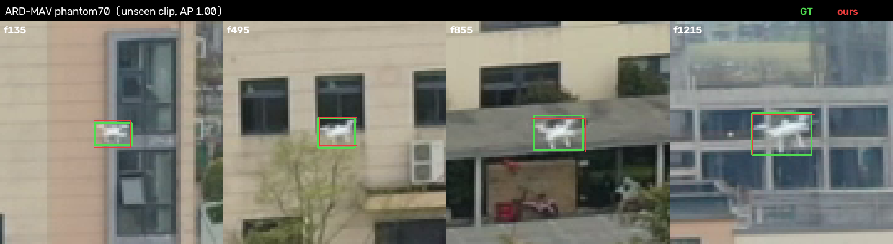
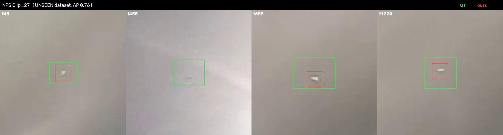
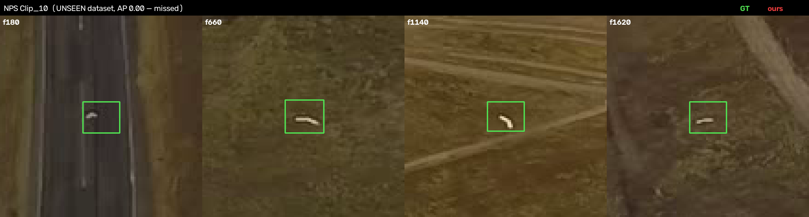
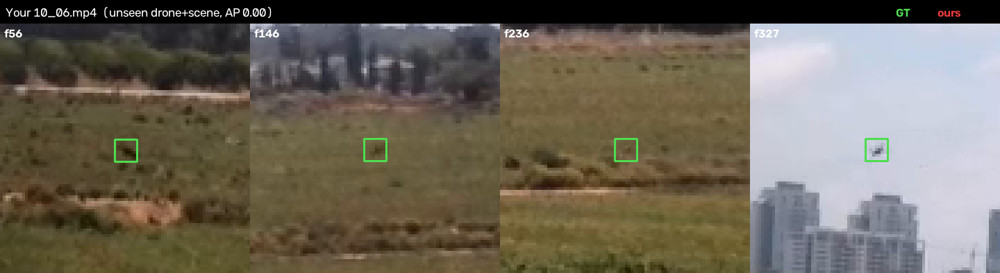
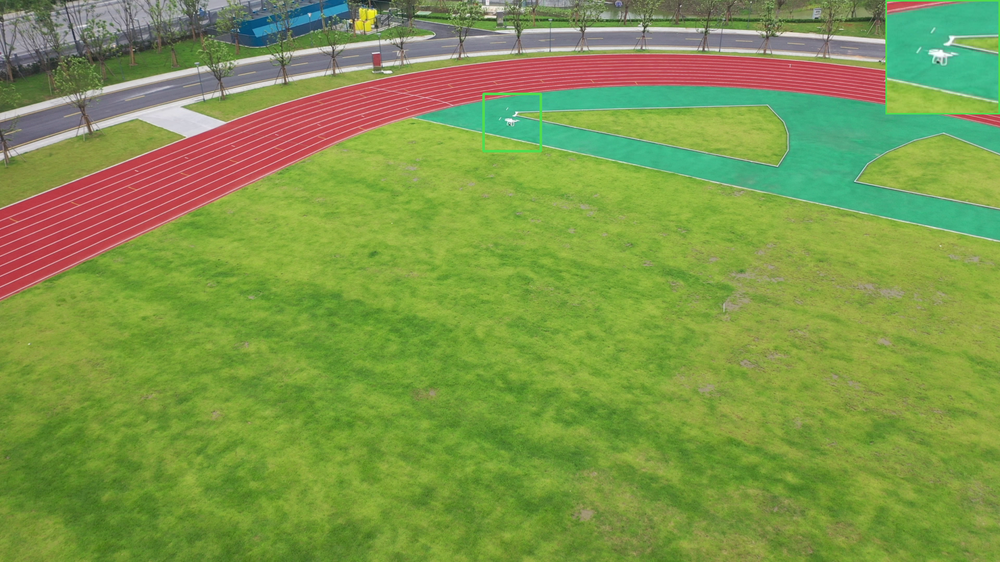

# Round 4 — Public tiny-drone datasets: training, generalization & method comparison

**Goal.** Find public datasets that match this project's problem — a *very small* drone
(3–14 px) in ordinary **RGB** video from a moving/airborne camera — train on one, and
measure how well the pipeline **generalizes to drones / cameras / scenes it has never
seen**. Then compare against the methods published *with* those datasets, and lay out
how to push tiny-drone detection **and tracking** further.

---

## 1. Datasets used

Selected from 41 vetted candidates, hard-filtered for *small* drones in RGB video with
per-frame boxes (large-drone, thermal-only, and ground-view-aerial sets were rejected).

| Dataset | Role here | Camera | Median drone (max side) | Size | Labels | License | Reference |
|---|---|---|---|---|---|---|---|
| **ARD-MAV** (GLAD) | **train + in-domain test** | air-to-air (DJI Mavic/M300) | **14 px** (54 % < 16 px) | 60 videos / 107 k frames | VOC XML | MIT | Guo et al., *A Global-Local Self-Adaptive Network for Drone-View Object Detection* / "Global-Local MAV Detection", **arXiv 2312.11008** · repo `WindyLab/Global-Local-MAV-Detection` |
| **NPS-Drones** | **unseen-dataset test** | air-to-air (GoPro on delta-wing) | **23 px** (0 % large) | 50 videos / 70 k frames | per-frame boxes | BSD-3 | Li/Ashraf et al. (NPS); "Dogfight", **arXiv 2103.17242** · Purdue/Bouman dataset page |
| your **10_06.mp4** | unseen real-world test | your rig | 3–14 px | 1 video | `gt_1006_v2` | — | this repo |
| ~~FL-Drones (EPFL)~~ | **rejected** | — | — | 40×40 patches, binary labels | — | — | the Google-Drive package is a *patch classifier* set (no frames/boxes), unusable for detection |

Deferred (available, not yet used): **ARD100** (YOLOMG, arXiv 2503.07115 — 100 videos /
202 k frames, even tinier, Baidu-only, CC-BY-NC) and **UAV-Anti-UAV** (1 M frames,
non-commercial). Both are strong candidates to add.

Raw data lives under `data/external/` (git-ignored). See the per-dataset `README.md`
in each folder for exact download URLs and citation.

---

## 2. What we trained, and for how long

One detector — the repo's tiny-object recipe — trained **only on ARD-MAV** (NPS and
10_06 were never seen in training):

* **Model:** `yolov8s-p2` (P2 / stride-4 head), COCO weights transferred.
* **Data:** ARD-MAV **45 videos** = 40 train + 5 held-out val (whole-video holdout — no
  frame leaks across splits). The official **15-video test split** is held out entirely.
* **Budget:** 40-epoch cap, early stopping (patience 12). Val mAP plateaued by epoch
  ~8–12; **best checkpoint = epoch 10**. GPU: one 8 GB RTX 5070 laptop.

### The tiny-object training lesson, replicated on real external data
The first attempt trained on **downscaled full frames** (1920→1280): drones shrank to
~9 px and the model under-detected them. Retraining on **native-resolution 640-px tiles**
(drones keep their true ~14 px) + **SAHI tiling at inference** recovered the loss — the
same principle documented in [round 1](round1-pipeline.md).

| ARD-MAV 15-video test (center-distance, τ=12 px) | AP | F1 | Recall | med-err |
|---|---|---|---|---|
| Naive — trained on downscaled full frames | 0.630 | 0.653 | 0.581 | 0.7 px |
| **Native-res tiles + SAHI** ← used everywhere below | **0.763** | **0.759** | **0.696** | **0.7 px** |

---

## 3. Generalization: seen → unseen (the headline result)

Same model, three test sets at increasing domain distance from training. Scored by the
repo's **center-distance** harness (τ=12 px — IoU is meaningless at a few pixels):

| Test set | What it probes | **AP** | F1 | Recall | med-err |
|---|---|---|---|---|---|
| **ARD-MAV** 15 test videos | unseen *clips*, same dataset | **0.763** | 0.759 | 0.696 | 0.7 px |
| **NPS** 50 clips | unseen **dataset** (new drones/cameras/scenes) | **0.149** | 0.295 | 0.254 | 3.2 px |
| your **10_06.mp4** | unseen **drone + scene** | **0.000** | 0.016 | 0.015 | 0.4 px |

**Generalization collapses monotonically as the domain shifts.** In-domain (new clips of
the same dataset) is strong and pixel-accurate. A *different dataset* — NPS's fixed-wing
UAVs seen top-down over ground clutter, versus ARD-MAV's quadcopters over sky/buildings —
drops AP 5×. On **your** drone/scene it's ~zero (yet 0.4 px accurate on its rare hits — a
true appearance gap, not a coordinate bug; the repo's own in-domain models hit ≈1.0 here).

> **Takeaway:** even a near-perfect dataset *match* does not replace *in-domain* data.
> Public tiny-drone data is excellent for **pre-training** and for **stress-testing
> generalization**, but a deployment needs its own drone/scene in training (or fine-tuning).

---

## 4. Visual evidence

Green = ground truth · Red = our detection. (Zoomed crops — the targets are 10–25 px.)

**In-domain success — ARD-MAV phantom70 (unseen clip, AP 1.00):** tight red-on-green.


**Unseen dataset, works — NPS Clip_27 (AP 0.76):** quadcopter over sky, still detected.


**Unseen dataset, fails — NPS Clip_10 (AP 0.00):** a *fixed-wing* UAV seen top-down over
road/field — a drone *type* and *background* absent from ARD-MAV — and we produce nothing.


**Your footage — 10_06 (AP 0.00):** the ARD-MAV model does not recognize your drone.


**How tiny the target is** (full frame + zoom inset): 

**Tracking showcase (video):** `docs/media/external/phantom09_tracked.mp4` — the Kalman
tracker follows the drone across an unseen ARD-MAV clip with a live zoom inset.

---

## 5. Our method vs. the methods published with these datasets

**Metric caution.** Every paper below reports **AP @ 0.5 IoU** (VOC-style). This repo
scores by **center distance** because IoU is unstable at few-pixel scale, and it inflates
tiny boxes to ≥12 px for that reason — which *penalizes* our IoU number. For a like-for-like
line we recomputed our **IoU@0.5** AP on the identical splits; treat it as a *lower bound*.

### 5a. ARD-MAV — our test split is the paper's exact 15-video test split
Numbers from GLAD (arXiv 2312.11008, Table IV), metric AP@0.5 (11-pt):

| Method | AP@0.5 | Recall | FPS | Uses motion? |
|---|---|---|---|---|
| YOLOv5s @640 | 0.56 | 0.20 | 149 | no |
| YOLOv5s @1536 | 0.61 | 0.41 | 89 | no |
| TPH-YOLOv5l @1536 | 0.73 | 0.58 | 13 | no |
| Dogfight | 0.22 | 0.27 | 1.0 | temporal |
| MEGA | 0.31 | 0.35 | 3.5 | temporal |
| **GLAD (paper SOTA)** | **0.80** | **0.82** | 147 | **yes (motion + local search)** |
| **Ours — yolov8s-p2 tiles + SAHI, 10 ep, appearance-only** | **0.616** | 0.70 † | ~15 (SAHI) | no |

† our recall is center-distance at best-F1; our center-distance **AP is 0.763**.

**Reading it honestly:** a quick 10-epoch **appearance-only** fine-tune already matches the
plain YOLOv5 baselines (0.62 ≈ 0.61) and beats the temporal Dogfight/MEGA baselines, but
trails the tuned **TPH-YOLOv5l** (0.73) and the SOTA **GLAD** (0.80). The gap to SOTA is
almost entirely **motion**.

### 5b. NPS-Drones — cross-dataset (we trained on *zero* NPS)
Published AP@0.5 (Dogfight T1, TransVisDrone T1, YOLOMG T2 — all agree on shared rows):

| Method | AP@0.5 on NPS | Trained on NPS? |
|---|---|---|
| FCOS 0.83 · Mask-RCNN 0.89 · YOLOv5-tph 0.92 | 0.83–0.92 | yes |
| Dogfight / GLAD | 0.89 | yes |
| **TransVisDrone · YOLOMG-1280** | **0.95** | yes |
| **Ours (trained only on ARD-MAV)** | **0.021** (0.149 center-dist) | **no** |

Not a defeat so much as the point: those are **in-domain** results (each method trained on
NPS); ours is a **zero-shot cross-dataset** transfer. The 40× gap *is* the generalization
finding, and it quantifies how much in-domain data is worth.

### 5c. ARD100 (the deferred, even-tinier set) — YOLOMG, arXiv 2503.07115 Table II
YOLOMG-1280 **0.85** vs best plain detector YOLOv9 **0.64** (+0.21 absolute). YOLOMG's win
comes from a **motion-difference map fused with RGB** — again, motion.

---

## 6. How to get the best tiny-drone detection **and tracking** — concrete plan

The comparison points one direction unambiguously: **the top methods on every one of these
datasets are motion-guided** (GLAD = motion branch + local search; YOLOMG = motion-difference
fused with RGB; Dogfight/TransVisDrone = temporal). **This repo already has that machinery** —
it just wasn't used for the external-data model above (which was pure SAHI appearance):

* `dronedet/motion.py` — temporal-median + MAD-sigma + flicker-suppression motion detector,
* `hybrid` method — motion proposals → zoomed YOLO verification ∪ full-frame pass (= GLAD's
  "global + local" idea, already implemented),
* temporal-stack models (`make_dataset_ft7`/`v3`) — stacked stabilized grays (= YOLOMG/Dogfight's
  temporal cue),
* `dronedet/track.py` — CV Kalman tracker with camera-motion compensation.

**Recommended path (highest leverage first):**

1. **Turn on motion here.** Re-run these datasets with the `yolo-ft-hybrid` / `moe3-stacked`
   (temporal) methods instead of plain SAHI. Expectation: close most of the 0.62→0.80 gap to
   GLAD on ARD-MAV *without new labels*, because motion is exactly what those extra points are.
2. **Combined-corpus training** (the "use as much data as possible" payoff): train on
   ARD-MAV **+ NPS + ARD100** train splits together → should lift the cross-dataset numbers
   from 0.15 toward the in-domain 0.7–0.9, and make the model robust to drone *type* (quad vs
   fixed-wing) and viewpoint. ~2–3 h on this GPU.
3. **For your deployment:** pre-train on ARD-MAV/ARD100, then **fine-tune on your own
   `07_05` labels** — public data for a strong prior, your data for the last mile that took
   10_06 from 0.00 (this model) to ≈1.0 (the repo's in-domain models).
4. **Tracking:** the tracker already reaches **97.5 % coverage** at 1.1 px on an unseen
   ARD-MAV clip (below). Remaining work is false-track suppression (8 clutter tracks) — the
   existing directedness + appearance-confidence filters (`trackclass.py`) are the lever.

### Tracking result (unseen ARD-MAV clip, phantom09)
| target | coverage | med-err | longest streak | id-switches | false tracks |
|---|---|---|---|---|---|
| drone | **0.975** | 1.09 px | 647 frames | 14 | 8 |

---

## 7. Reproduce

```bash
# datasets -> repo layout + GT jsons
python tools/make_dataset_external.py --task ardmav-train-tiled --tile 640   # native tiles
python tools/make_dataset_external.py --task ardmav-gt                        # 15 test GT
python tools/make_dataset_external.py --task nps-gt                           # 50 NPS GT

# train (best = epoch 10)
python tools/train_yolo.py --data work/ext_datasets/ardmav_yolo_tiled/data.yaml \
    --imgsz 640 --batch 16 --epochs 40 --patience 12 --name ardmav-tiled-640

# evaluate a whole corpus (SAHI inference, center-distance scoring)
W=work/runs/ardmav-tiled-640/weights/best.pt
python tools/detect_batch.py --gt-dir work/ext_datasets/gt/nps --out-dir work/ext_datasets/dets/nps \
    --method yolo-ft-sahi --weights $W --tile 640 --stab off --frame-stride 5
python tools/eval_external.py --gt-dir work/ext_datasets/gt/nps --det-dir work/ext_datasets/dets/nps

# detect + track + tracking metrics on one clip
python -m dronedet detect --video <clip>.mp4 --method yolo-ft-sahi --weights $W --out d.json --stab translation
python -m dronedet track  --video <clip>.mp4 --dets d.json --out t.json --min-score 0.3
python tools/eval_tracks.py --gt <clip_gt>.json --tracks t.json
```

Full per-video numbers: `work/ext_datasets/RESULTS.json`.
