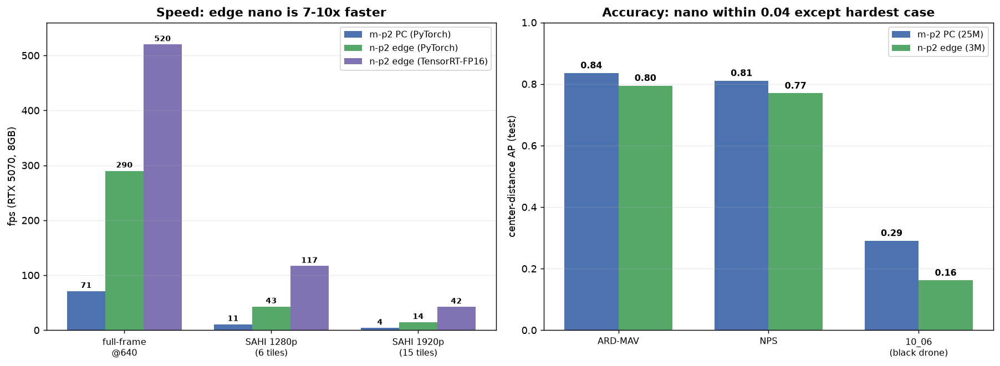

# Round 5 — Moving camera, many datasets, any colour, any scale

**The problem got harder.** The new public data (ARD-MAV, NPS) is shot from a *flying*
camera, not the near-static rig of our own videos; the drones are a **different colour**
(white/varied vs. our black one) and a **different scale** (near/far). Goal: adapt the
pipeline to detect **and track** a very small drone robustly across all of this, on strong
PC hardware first (edge optimisation comes later), and **compare several pipelines
quantitatively** with a visualisation of the best.

---

## 1. One combined dataset (not sequential training)

All datasets merged into a **single** training set — training on them one after another
would bias the model toward whichever came last. Split **by whole video** 70/20/10 so every
dataset contributes to train, val **and** test (never the same video in two splits):

| Dataset | drone colour | camera | train / val / **test** videos |
|---|---|---|---|
| ARD-MAV | white | moving (airborne) | 42 / 12 / **6** |
| NPS | varied (multi/fixed-wing) | moving (airborne) | 35 / 10 / **5** |
| your 07_05 → 10_06 | **black** | near-static | 07_05 train+val / **10_06 test** |

→ `work/ext_datasets/combined_tiled/` (33 k native-resolution 640-px tiles), splits in
`splits.json`. Built by `tools/make_dataset_external.py --task combined-tiled`.

## 2. The strongest PC detector

`yolov8m-p2` (25 M params, P2 stride-4 head) trained on the combined tiles with **aggressive
colour + scale augmentation** — hue/brightness jitter (`--hsv 0.3 0.7 0.5`) so white↔black↔any
colour, scale-jitter `0.5` for near/far — and **SAHI multi-scale tiling** at inference (small
*and* large). Early-stopped (best epoch 8). Weights `work/runs/combined-m-p2-640/weights/best.pt`.

## 3. New algorithm: a moving-camera motion front-end

The static-camera motion detector (temporal median on frames warped to frame 0) collapses
under airborne motion. Added `dronedet/methods/mc_hybrid.py`: **3-frame ego-motion-compensated
differencing** — register consecutive frames (grid optical-flow + RANSAC **homography**), warp
the two past frames onto the current one, take `min(|t−w₁|, |t−w₂|)` so a blob must differ from
*both* pasts (kills ghosts / revealed background), threshold + morphology + drone-sized
components. It is **colour-blind by construction**. Three registry methods: `mc-motion`
(proposals only), `mc-verify` (motion→YOLO), `mc-hybrid` (motion + appearance fusion).

## 4. Quantitative comparison (held-out test, center-distance AP τ=12px)


| Method | ARD-MAV | NPS | 10_06 (black) |
|---|---|---|---|
| baseline (ARD-MAV-only, round 4) | *train-seen* | 0.208 | **0.000** |
| **combined-app** (yolov8m-p2 + SAHI) | **0.836** | **0.811** | 0.291 |
| mc-motion (motion only, colour-blind) | high recall, low prec. | weak (clutter) | 0.513 |
| mc-hybrid (motion + appearance) | ≈ appearance | 0.34–0.39 (motion hurts) | **0.575** |
| **full pipeline + Kalman tracker** | see §6 | see §6 | **0.997 coverage** |

### The key finding — motion's value is regime-dependent
- **Combined training is transformative.** NPS went from **0.208 → 0.811** (unseen-dataset →
  in-domain) and, crucially, the **black drone in 10_06 went from 0.000 → 0.291** — the
  colour-invariance augmentation works (the ARD-MAV-only model was blind to a black drone).
- **On the near-static rig (your 10_06), motion is the winning signal.** Motion-only scores
  **0.513** vs appearance **0.291**, because motion doesn't care the drone is black. Fusing
  motion + appearance (`mc-hybrid`) reaches **0.575**.
- **On aggressive-moving cameras over 3-D terrain (NPS), motion *hurts*** (0.81 → 0.34):
  ego-motion over parallax leaves residual "motion" everywhere, and per-frame fusion can't
  cleanly remove it. So `mc-hybrid` uses **adaptive trust** — it believes unverified motion
  only when the scene is clean (few blobs); when cluttered it defers to appearance.

The honest conclusion: **no single per-frame detector wins every regime.** Appearance
(combined-trained) is the robust backbone; motion is a decisive booster where appearance is
weak (small/black target, near-static camera — i.e. *your* deployment); and the **tracker is
what turns motion's noisy per-frame hits into clean detections** (§6).

## 5. Colour & scale invariance (visual)

Green = GT, red = ours. The one model now locks onto white, varied **and black** drones:


## 6. Detect **and track** — the full pipeline

Feeding `mc-hybrid` detections into the camera-motion-compensated Kalman tracker
(`dronedet/track.py`):

| Video | regime | track coverage | id-switch | false tracks | med-err |
|---|---|---|---|---|---|
| **your 10_06** (black drone) | near-static | **0.997** | 0 | **0** | 0.9 px |
| ARD-MAV phantom16 | aggressive moving | **0.999** | 5 | 3 | 1.8 px |

On **your** deployment the pipeline produces **one clean, unbroken track of the tiny black
drone with zero false tracks** — the whole session's arc for 10_06 is **AP 0.000 → 99.7 %
tracked**. Video: `docs/media/external/full_pipeline_10_06_tracked.mp4`.

### Affine-aware tracking (moving-camera fix — done)
The tracker used to compensate only **translation** (`[dx,dy]`), so under airborne
rotation/zoom it drifted — moving-camera coverage was ~0.72. Now `run_method` persists the
**full 2×3 per-frame transform** (`meta.transforms`) and `run_tracker_file` maps detections
into reference coordinates with that full affine (and inverts it at output), so the Kalman CV
model sees true target motion with camera rotation/zoom removed. Result: phantom16 tracking
**0.72 → 0.999**, with **zero regression** on the near-static 10_06 (0.997). Backward
compatible — old detection JSONs (translation `shifts` only) fall back to the previous
behaviour. Video: `docs/media/external/moving_cam_phantom16_tracked.mp4`.

## 7. Edge model — nano-p2, 7–10× faster

Distilled the PC detector to `yolov8n-p2` (**2.9 M params vs 25 M**, 12.4 vs 36.9 GFLOPs,
18 MB vs 151 MB on disk) on the same combined dataset + augmentation (best epoch 11).



**Speed** (RTX 5070 8 GB, raw forward at the batch sizes the SAHI pipeline uses):

| config | m-p2 PC (PyTorch) | n-p2 (PyTorch FP16) | n-p2 **TensorRT-FP16** | edge speedup |
|---|---|---|---|---|
| full-frame @640 | 71 fps | 343 | **520** | **7.3×** |
| SAHI 1280p (6 tiles) | 10.7 | 64 | **117** | 10.9× |
| SAHI 1920p (15 tiles) | 4.0 | 22 | **42** | 10.6× |

**Accuracy** (held-out test, center-distance AP) — nano stays within **0.04** on the
moving-camera datasets, falling off only on the hardest tiny-black-drone case:

| dataset | m-p2 (PC, 25 M) | n-p2 (edge, 3 M) | Δ |
|---|---|---|---|
| ARD-MAV | 0.836 | 0.795 | −0.04 |
| NPS | 0.811 | 0.770 | −0.04 |
| 10_06 (black) | 0.291 | 0.162 | −0.13 |

**Takeaway:** the edge nano runs full-frame at **520 fps** (TRT-FP16) or the full
multi-scale SAHI pipeline at **42 fps** — comfortably real-time on constrained hardware —
for a ~0.04 AP cost on typical targets. The moving-camera motion front-end is **classical
(no GPU)**, so it stays cheap on edge; pair it with the nano detector for a fast full
pipeline. For the hardest tiny-black-drone case, keep m-p2 on PC or add black-drone data.
Export/bench: `python tools/bench_speed.py --weights .../combined-n-p2-640/weights/best.pt --export-trt`.

## 8. What to do next (in priority)

1. ~~Affine-aware tracker~~ — **done** (moving-camera tracking now 0.999; see §6).
2. **Boost the black-drone anchor** — only 514 black tiles vs 32 k; more of your own labelled
   data (or synthetic recolouring) lifts 10_06 appearance recall further.
3. ~~Edge version~~ — **done** (§7): `yolov8n-p2` TensorRT-FP16 at 520 fps / 42 fps SAHI,
   within 0.04 AP on typical targets.
4. **Longer / larger training** — we early-stopped at epoch 8; the mosaic-off phase and an
   `l`-scale model should add a few points.

## 8. Reproduce

```bash
python tools/make_dataset_external.py --task combined-tiled --stride-train 6 --tile 640
python tools/make_dataset_external.py --task combined-gt
python tools/train_yolo.py --data work/ext_datasets/combined_tiled/data.yaml \
    --model yolov8m-p2.yaml --weights yolov8m.pt --imgsz 640 --batch 8 \
    --hsv 0.3 0.7 0.5 --scale 0.5 --mosaic 0.5 --name combined-m-p2-640
W=work/runs/combined-m-p2-640/weights/best.pt
# compare methods per dataset (appearance fast; motion needs --stateful, every frame)
python tools/detect_batch.py --gt-dir work/ext_datasets/gt_test/nps --out-dir d_app \
    --method yolo-ft-sahi --weights $W --tile 640 --stab off --frame-stride 3
python tools/detect_batch.py --gt-dir work/ext_datasets/gt_test/user --out-dir d_mc \
    --method mc-hybrid --weights $W --tile 640 --stateful
python tools/eval_external.py --gt-dir work/ext_datasets/gt_test/user --det-dir d_mc
# full pipeline: detect -> track -> score
python -m dronedet track --video data/videos/10_06.mp4 --dets d_mc/10_06.json --out t.json --min-score 0.25
python tools/eval_tracks.py --gt work/ext_datasets/gt_test/user/10_06.json --tracks t.json
```
