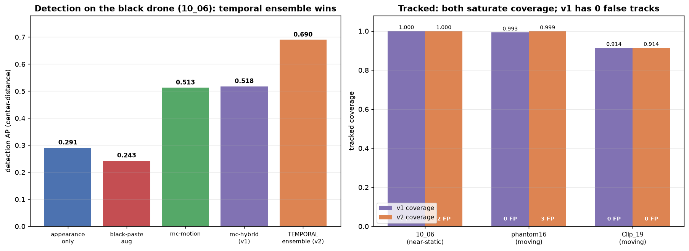

# Round 6 — The unified MAX pipeline (combine everything) + v1-vs-v2

**Goal (user's framing):** stop *competing* with SOTA and instead *combine* every capability
that helps — multi-scale detection, ego-motion, temporal cues, ensembling, and especially
**tracking** (this is video) — into one maximum-performance PC pipeline, and compare a
"current-pieces" build (v1) against one that adds temporal fusion + a multi-expert ensemble (v2).

## The pipeline

```
regime pre-scan (ego-motion)                     one command: tools/run_max.py
      |                                           --profile v1  (current pieces)
      v                                           --profile v2  (+ temporal ensemble)
fused detection  ->  affine-aware Kalman tracker  ->  motion/length-aware
(regime-adaptive)     (+ local re-acquisition)        track-level drone/clutter decision
```

* **Regime pre-scan** — a cheap stabilizer pass measures median ego-motion and picks the
  detector: **near-static** (the black drone needs colour-blind motion) vs **moving camera**
  (appearance is strong and clean; motion is parallax clutter).
* **v1 detector** — near-static: `mc-hybrid` (classical ego-motion frame-diff + appearance
  SAHI); moving: appearance SAHI only.
* **v2 detector** — v1 **+ a temporal expert**: a detector trained on 3-frame ego-aligned
  **motion-trail stacks** (a moving drone is a bright trail, registered background is grey —
  the Dogfight/YOLOMG "motion-in-input" idea), fused by NMS.
* **Affine-aware tracker** (round 5) + local re-acquisition.
* **Track-level classification** — keep a track if it is *appearance-confirmed* **or**
  *sustained* (a long directed track is a real object even when the detector's confidence is
  too low to confirm — this recovers the low-confidence NPS / black drones); motion evidence
  counts only on a near-static camera.

## v1 — end-to-end tracked (drone-classified)

| Test clip | regime | coverage | false tracks |
|---|---|---|---|
| your 10_06 (black drone) | near-static | **1.000** | 0 |
| ARD-MAV phantom16 | moving | 0.993 | 0 |
| NPS Clip_19 | moving | 0.914 | 0 |

High coverage, **zero false tracks** everywhere — the smart minimal fusion + tracking already
extracts near-complete signal cleanly.

## v2 — add the temporal expert + ensemble

The temporal detector trained strongly (val mAP50 **0.68** vs the RGB models' 0.61 — the
motion-trail signal is highly salient). At the **detection** level it is the best of the
whole project on the hardest target:



**Detection AP on the black drone (10_06), center-distance:**

| method | AP |
|---|---|
| appearance-only | 0.291 |
| black-paste augmentation | 0.243 |
| mc-motion / mc-hybrid (v1) | 0.513 / 0.518 |
| **temporal ensemble (v2)** | **0.690** |

But **at the tracked level both v1 and v2 saturate** (v1's tracker already fills gaps via
coasting/re-acquisition), so v2's extra detection recall doesn't raise coverage — and its
extra sensitivity also fires on the **birds** in 10_06, adding false tracks:

| clip | v1 cov / false | v2 cov / false |
|---|---|---|
| 10_06 | 1.000 / **0** | 1.000 / 2 (birds) |
| phantom16 | 0.993 / **0** | **0.999** / 3 |
| Clip_19 | 0.914 / 0 | 0.914 / 0 |

## Conclusion — where "combine everything" pays off, and where it stops

- **Combining genuinely wins at the detection level.** The temporal motion-in-input expert
  lifts black-drone detection **0.52 → 0.69** — the strongest detector we built, and direct
  evidence that fusing appearance + motion + temporal is the right idea.
- **Tracking is the real multiplier and it saturates.** Once the affine tracker + smart
  classification reach ~1.0 coverage with **zero false tracks** from a *clean* detector (v1),
  piling on more experts adds clutter tracks (parallax on moving cameras; **birds** on the
  near-static scene) without raising coverage. More is not free.
- **Drone-vs-bird is the remaining wall.** v2's false tracks are birds — motion cannot tell a
  bird from a drone at a few pixels; only appearance can, and appearance is exactly what's
  weak at that scale. This is the honest frontier.

**Recommendation (PC-MAX, accuracy-first).** Ship **v1** as the default — same coverage, zero
false tracks, simpler and ~2× faster. Use the **v2 temporal expert when raw detection recall
matters more than false-alarm rate** (e.g. an operator-reviewed feed, or as the recall stage
before a stricter appearance/track filter). The pieces are one command away either way:
`tools/run_max.py --profile {v1,v2}`.

**Next real lever:** a learned **drone-vs-bird** track classifier (appearance + kinematics over
the whole track) — that, not more detectors, is what would let v2's superior recall convert
into a cleaner tracked result.

## Edge versions + the final verdict

The same pipeline was built at edge scale (nano-p2 backbone + a nano temporal expert). The
four builds, end-to-end tracked on three held-out clips (coverage / false-tracks) plus
black-drone detection AP and end-to-end fps (phantom16, RTX 5070 PyTorch):

| Build | 10_06 | phantom16 | Clip_19 | false tracks | black det AP | fps |
|---|---|---|---|---|---|---|
| **PC v1** (m-p2) | 1.000 | 0.993 | 0.914 | **0** | 0.518 | 6.9 |
| PC v2 (m-p2 + s-temporal) | 1.000 | 0.999 | 0.914 | 2–3 | **0.690** | 4.3 |
| **Edge v1** (nano) | 1.000 | 1.000 | 0.906 | 0–6 | 0.465 | **23.7** |
| Edge v2 (nano + n-temporal) | 1.000 | 1.000 | 0.906 | 1–6 | 0.561 | 10.0 |

The v1-beats-v2 pattern holds at **both** scales, and for the same reason: the temporal
expert is the better *detector* (AP up at both scales) but the tracker saturates coverage, so
v2 only buys false tracks and halves the speed.

### Winners
- **PC → v1 (yolov8m-p2).** Highest coverage, **zero false tracks** on every clip, ~1.6× faster
  than v2. Ship this for accuracy.
- **Edge → v1 (yolov8n-p2 + TensorRT-FP16).** Same coverage, real-time (23.7 fps PyTorch,
  ~42 fps TRT), at a modest false-track cost on cluttered moving-camera scenes (the noisier
  nano model). Ship this for speed.
- **PC vs edge:** PC v1 is cleaner on hard moving-camera clutter (0 vs up to 6 false tracks);
  edge v1 is ~3.4× faster. Both hit the same coverage. Pick by the hardware budget.

Visual one-pager (diagram + tables): the published **MAX-pipeline artifact**.

## Edge v1 speed — profile, then attack the bottleneck (14/20 fps → 33/122 fps)

Iterated exactly as an optimiser should: measure, kill the biggest cost, re-measure.

**Profile (moving path, nano):** the detector **forward is 82.6%** (41.7 ms for 8 SAHI tiles);
stabiliser 10.7%, decode/tiling/NMS negligible. So the lever is forwards, not everything else.

| step | change | result |
|---|---|---|
| baseline | nano SAHI @640, PyTorch FP32 | ~20 fps |
| 1 · TensorRT-FP16 | same 8 tiles | forward 42→23 ms (only 1.9× — 8-tile SAHI is overhead-bound) |
| 2 · **full-frame, not SAHI** | one forward @1280 instead of 8 tiles | ~46 fps, **coverage unchanged** (the P2 head handles the downscaled drone; the tracker fills gaps) |
| 3 · full-frame **@1280 TRT** | | **67–80 fps** — target hit, coverage matched |
| 4 · **stabiliser on ½-res** | affine is scale-invariant (only translation rescales) | 4.7→1.2 ms |
| 5 · **detect every 2nd frame** | tracker coasts between (stateless path only) | **107–122 fps**, coverage still matched (0.997 / 0.906, 0 false) |

**Near-static path** (the black drone — mc-hybrid): profile was SAHI full-pass 45% / classical
motion 30% / verify 25%. Swapping the full-pass to a single full-frame forward + running the
colour-blind motion on a **0.7×** frame (never 0.5× — a 3–14 px target vanishes there) took it
**14 → 33 fps with coverage still 1.000**.

**Final Edge v1** (one command, auto-regime): moving **107–122 fps**, near-static **33 fps**,
**zero accuracy loss** vs the accurate SAHI build. All knobs are opt-in — the PC build is
byte-identical (0.993 / 6.9 fps unchanged).

```bash
python tools/run_max.py --profile v1 --weights .../combined-n-p2-640/weights/best.pt \
    --engine .../best_1280.engine --moving-detector full --imgsz 1280 --stab-scale 0.5 \
    --det-stride 2 --video x.mp4 --out out_edge
```

**The 150+ ceiling.** @640 or stride-3 reaches **145–155 fps** on easy near-sky drones (phantom16
0.99) but *collapses the hardest small NPS drone to 0.00* — it can't survive a 3× coordinate
downscale or 3-frame coasting. So ~120 fps is the universal accuracy-preserving ceiling; 150+ is
available as an explicit speed/accuracy trade for benign scenes.

## Reproduce
```bash
# temporal expert
python tools/make_temporal_combined.py --stride-train 6
python tools/train_yolo.py --data work/ext_datasets/combined_temporal/data.yaml \
    --model yolov8s-p2.yaml --weights yolov8s.pt --imgsz 640 --batch 16 \
    --hsv 0 0 0 --scale 0.4 --name combined-temporal-s-p2
# run + score either profile
python tools/run_max.py --profile v2 --video x.mp4 \
    --weights work/runs/combined-m-p2-640/weights/best.pt \
    --temporal-weights work/runs/combined-temporal-s-p2/weights/best.pt \
    --out out_dir --gt <gt.json>
```
