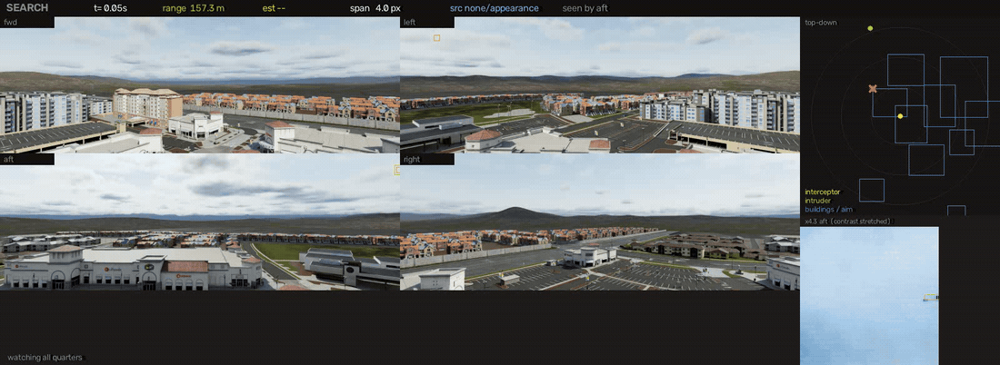
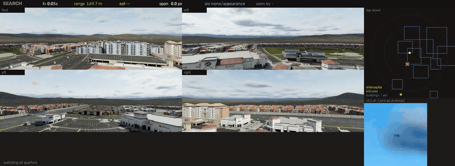

# Pursuit — closing the loop: see the drone, then hit it

## In one screen

**The design, in one sentence.** Only bearing steers — a pixel is a ray, so
bearing is essentially exact, while monocular range (`fx·S/span`) is poor and
its error grows with range², so range is allowed to schedule the speed and latch
the terminal phase and nothing else. The law is therefore **proportional
navigation** rather than "centre it and drive forward", and the sensor is **four
96° cameras 90° apart**, which takes *pointing* out of the mission entirely.

| what was measured | result | evidence |
|---|---|---|
| the city mission — 24 arrival bearings, closure isolated | **24/24 intercepted, 0 buildings hit**; mean true closest approach **0.080 m** | [`work/pursuit/city/METRICS.md`](../work/pursuit/city/METRICS.md) |
| end to end, real detector, 62 engagements across two scenes | **54/62 — 87.1 %**, 95 % CI [76.6 %, 93.3 %] (Wilson) | [`METRICS.md`](../work/pursuit/final/METRICS.md) · [`ANALYSIS.md`](../work/pursuit/final/ANALYSIS.md) |
| guidance alone, perfect sensor, no renderer | **42/42** `full`, **120/120** `stress`, **7/7** `ladder` | `.venv/bin/python -m pursuit.sandbox --suite stress` (also `full`, `ladder`) |
| the ring's long-range sensor against urban clutter | **0/3** — the one part that is not finished, and it is a *detection* problem | [`work/pursuit/city_pipe/results.json`](../work/pursuit/city_pipe/results.json) |

<p align="center">
  
</p>

**540 tests, 23 s** (`.venv/bin/python -m pytest`), and almost every invariant in
this package exists because something measurable broke first. That ledger is
[What actually broke, and what fixed
it](#what-actually-broke-and-what-fixed-it) — one row per bug, with its cause,
its fix, and the test that now pins it.

Jump: [the camera ring](#the-camera-ring-360-degrees-and-the-mission-that-needs-it) ·
[why not a visual servo](#why-a-visual-servo-is-the-wrong-law-here) ·
[the bug ledger](#what-actually-broke-and-what-fixed-it) ·
[the city mission](#the-mission-hold-over-a-city-and-stop-a-strike) ·
[measured behaviour](#measured-behaviour) ·
[the detector](#the-detector) · [running it](#run-it)

---

The rest of this repository answers *is there a drone in this video*. This
package answers the next question: **can the aircraft carrying the camera catch
it**. One drone runs, one drone chases, the chaser has nothing but its own
forward-facing camera, and a run either ends with the two of them touching or it
does not.

Two stages, exactly as posed:

1. **Detect and track** the fleeing drone — `perception.py`
2. **Close on it until collision** — `guidance.py`

The interface between them is one small dataclass (`TargetEstimate`: a bearing, a
pixel span, a flag). That boundary is the most useful thing in the package,
because it lets the same guidance law fly against a *perfect* sensor and against
the real one — and the difference between those two runs is the perception's
contribution, measured rather than argued about.

---

## Run it

The simulator is a long-lived server inside the Isaac Sim container; the brain
runs on the host where the weights and CUDA stack live. See "Why two processes"
below. Everything in the two blocks that follow needs that container **and** the
PEGASUS camera calibration, neither of which is part of this repository; the
weights under `work/runs/` are training output and are not tracked either, so
build one first (see [The detector](#the-detector)). The sandbox block at the
end needs none of it.

```bash
# 1. simulator (skydome loads in ~3 s, Rivermark in ~26 s warm and minutes cold;
#    it stays up across many runs, which is the whole point of a server)
docker exec -d isaac-sim bash -c "cd /tmp/dev/dronedet && /isaac-sim/python.sh \
    simulators/pegasus/scripts/pursuit_server.py --scene skydome"

# 2. the guidance law against a perfect sensor -- isolates the control loop
.venv/bin/python -m pursuit.run_pursuit --detector oracle --suite full \
    --out work/pursuit/oracle --video

# 3. the whole thing, camera and all -- both scenes, and the exact run behind
#    the 54/62 above (round-7 fusion, fine-tuned here, one hard-negative pass)
.venv/bin/python -m pursuit.tools.record_final \
    --weights work/runs/sim-fusion-m-p2-hn/weights/best.pt

# 4. the difficulty ladder, outdoors in the town: single-axis sweep up to an
#    evader that reverses heading, altitude and sense (--scene rivermark above)
.venv/bin/python -m pursuit.run_pursuit --detector yolo \
    --weights work/runs/sim-n-p2/weights/best.pt --suite ladder \
    --out work/pursuit/ladder-town --video

# 5. which detector to use is a measurement, not a preference
.venv/bin/python -m pursuit.tools.compare_detectors --out work/pursuit/detcmp.json

# 6. intruder ingress: empty frame, something arrives, kill it
.venv/bin/python -m pursuit.run_pursuit --detector yolo --weights <w> \
    --suite ingress --out work/pursuit/ingress-town --video

# 7. gather every clip from every run into one page
.venv/bin/python -m pursuit.tools.gallery --out work/pursuit/gallery
```

And the mission the whole thing is for — hold over a city with a **four-camera
360 degree ring** and stop a strike before it lands:

```bash
# the simulator, with the ring instead of one nose camera
docker exec -d isaac-sim bash -c "cd /tmp/dev/dronedet && /isaac-sim/python.sh \
    simulators/pegasus/scripts/pursuit_server.py --scene rivermark --cameras ring"

# prove the ring really has no hole in it before trusting anything it reports
.venv/bin/python -m pursuit.tools.ring_probe --range 40

# how far out the ring can see an inbound intruder -- this number *is* the
# defended radius, at 0.6 metres per metre
.venv/bin/python -m pursuit.tools.ring_detect_range --bearings 30,150,300 \
    --quiet-frames 40

# the whole mission: boot, fly 24 arrival bearings, record ten, score it
.venv/bin/python -m pursuit.tools.record_city --weights work/runs/sim-n-p2/weights/best.pt
.venv/bin/python -m pursuit.tools.city_report --search work/pursuit/city
```

And the fast loop, which needs no simulator at all and runs an entire scenario
matrix in a couple of seconds:

```bash
.venv/bin/python -m pursuit.sandbox --suite stress
.venv/bin/python -m pursuit.sandbox --suite full --sweep "nav_gain=3,4,5;kp_yaw=1.0,1.4,1.8"
.venv/bin/python -m pursuit.tools.robustness       # how bad can the camera get?
```

---

## The camera ring: 360 degrees, and the mission that needs it

Everything above this section is one forward camera. That made *pointing* part of
the mission: a target outside a 76 degree cone did not exist, so acquisition
meant turning the aircraft — a step-and-stare pattern that takes ten seconds to
sweep a circle. Read the failure tables again with that in mind and most of them
say the same thing.

`--cameras ring` bolts **four wide cameras 90 degrees apart** to the airframe
and removes the mechanism instead of tuning it.

| | nose | ring |
|---|---|---|
| cameras | 1 | 4 (`fwd` `left` `aft` `right`) |
| field of view each | 76.0° H × 47.8° V | 96.0° H × 41.8° V |
| coverage | 76° of 360 | **384° of 360 — 6° of overlap at every seam** |
| angular resolution | 16.1 px/deg | **16.1 px/deg** (2048×704 each) |
| sees above the boresight | 15.6° | **20.9°** |
| how it finds a target behind it | yaws for up to 10 s | it is already looking |

The nose camera's cone is asymmetric because the real payload is tilted down:
76.0° H is 36.9° left and 39.1° right of the boresight, and 47.8° V is 15.6° up
against 32.2° down. Those six numbers come straight out of the shipped
intrinsics (`pursuit.sandbox.SIM_INTRINSICS`, `fx` 921.8, `cx` 691.6, `cy`
257.2) and they are quoted in that form throughout this document, because "the
camera cannot look up" is the sensor limit that cost this project the most
engagements and it is not a rounding artefact.

The angular resolution is deliberately identical, so the ring is not a cheaper
sensor — it is the same sensor four times, and the cost is render throughput
rather than detection range.

**Verified rather than asserted.** `pursuit.tools.ring_probe` walks a target all
the way around the aircraft at a heading of 37° (not zero — a ring that only
works when the airframe is axis-aligned is a ring with a missing rotation in it)
and asks the simulator which cameras can see it at each bearing:

```
120 bearings at 40 m
bearings with NO camera (rendered)      0
bearings with NO camera (projected)     0
bearings seen by two cameras (seam)     8  -> 6.7% of the circle
label vs projection gap: mean 0.90 px, max 1.85 px
  fwd: 30 bearings   left: 30   aft: 30   right: 30
RING COVERS 360 DEGREES
```

Four quarters of exactly 30 bearings each, and 6.7 % of the circle in a seam —
which is 4 × 6° of overlap, to within the sampling. The same response at the
same off-axis angle in all four cameras is the strongest available evidence that
the mount rotations are right.

The block above is the run stored in
[`work/pursuit/ring_probe.json`](../work/pursuit/ring_probe.json), and one
caveat travels with it: it was probed on the earlier **1600×640** ring
(`fx` 720.3, 47.9° V) rather than the 2048×704 the table above describes.
Coverage depends only on the 96° horizontal field and the four 90° mounts,
both unchanged, so 0 blind bearings and 8 seam bearings still hold — but the
sub-pixel label-versus-projection gap scales with resolution and is not the
shipped sensor's figure. `ring_probe.py` also still hardcodes the old `fx` in
the one line that prints an analytic span.

<p align="center">
  
</p>

That clip is the whole argument for the ring: the intruder arrives 145° off the
nose, in the cone one forward camera cannot see at all; it is in the `aft` feed
from the first frame; and the outline walks `aft → right → fwd` as the
interceptor turns into the chase, two seam crossings without a break in the
track. The aircraft turns in order to *fly*, not in order to *look*.

### Seeing 3 pixels: the half of the ring that is not a YOLO

The ring keeps the nose camera's angular resolution, so an intruder at 140 m is
**3.1 px** across — 2.9 px by 150 m — and no appearance model is going to find
it at either. Something has to,
because detection range is not one figure of merit among several here — it
converts into *defended radius* at 0.6 metres per metre (`defended_radius()`),
which is a steeper exchange rate than anything else in the system offers.

What finds it is the thing the rest of this repository was built for. An
interceptor holding station has four **stationary** cameras looking at a city
that is not going anywhere, so a per-pixel background model sees the target's
*whole* contrast rather than the sliver of it that changes between two frames.
Measured on live Rivermark, an intruder running in at 12 m/s, three bearings,
fraction of frames with a detection inside 1.2°:

| range | span | ego-compensated frame differencing | **background model** |
|---|---|---|---|
| 60–80 m | 6.2 px | 0.64 | **1.00** |
| 80–100 m | 4.8 px | 0.54 | **0.98** |
| 100–120 m | 4.0 px | 0.29 | **0.84** |
| 120–140 m | 3.3 px | 0.23 | **0.52** |
| 140–160 m | 2.9 px | 0.12 | **0.27** |
| reliable to (≥50 %) | | 100 m | **140 m** |
| **defends a radius of** | | 46 m | **70 m** |
| false blobs per frame, empty sky | | 11.4 | **9.6** |

Every detection fraction above is recomputed from
[`work/pursuit/motion_bg2.json`](../work/pursuit/motion_bg2.json) — three
arrival bearings flown from 220 m in to 25 m, 978 sampled frames — and the two
rows under them follow from it, the second through `defended_radius()`:

```bash
.venv/bin/python -m pursuit.tools.ring_detect_range --bearings 30,150,300 \
    --start-range 220 --quiet-frames 40 --sweep background=1,0 \
    --out work/pursuit/motion_bg2.json
```

(The false-blob row is the same command's quiet-frame pass, which it prints but
does not store, and those two are *capped* numbers, measured while the stage
still truncated its output at twelve contacts. Uncapped, a rendered Rivermark
sky returns about **50** a frame — which is the real figure the discrimination
stage below has to work against, and the reason the cap was raised to 64.)

Both run at full resolution with **no morphological opening**, and that sentence
is worth two more measurements. Halving the frame and opening the mask with a
3×3 kernel are the settings `dronedet`'s moving-camera detector uses, and they
are right there. Here they cost everything:

| scale | opening | reliable to | first seen |
|---|---|---|---|
| **1.0** | **none** | **100 m** | **167 m** |
| 1.0 | 3×3 | 80 m | 159 m |
| 0.5 | none | 80 m | 137 m |
| 0.5 | 3×3 | never 50 % | 99 m |

An opening is an erosion followed by a dilation, so a 3×3 kernel **deletes
anything smaller than 3×3** — and at 100 m the target is smaller than 3×3. The
step that exists to remove speckle was removing the drone.

**And one bug worth keeping, because it inverts the usual intuition.** The first
background model got *worse the closer the target came* — 0.23 at 110 m and
**0.00** at 30 m. The per-pixel noise estimate was being updated on every pixel
including the target's own, so a drone that lingers on the same pixels — which
is exactly what one on a near-constant inbound bearing does, more and more as it
closes — feeds its own contrast into its own threshold until it is suppressed.
Gating the statistics to background pixels fixes it; the suppression takes about
sixty frames of dwell to become visible, so `test_ring.py` pins it with seventy.

### Fifty blobs and one drone

Detection was never the hard part; **discrimination** was. That same empty
Rivermark sky produces about **50 motion blobs a frame** across the ring — fixed
renderer artefacts on high-contrast edges — so the drone is one contact in
fifty, and it is neither the brightest nor the most persistent. It is the least
persistent, because it is 3 px across and detected on a fraction of the frames
while an artefact fires on nine tenths of them.

(That figure is per tick across all four cameras, counted in
[`work/pursuit/city_pipe/`](../work/pursuit/city_pipe/results.json)'s telemetry:
mean 44.8 contacts, median 49, over 217 ticks of a live Rivermark engagement.
An earlier "about ten" is quoted in a few docstrings and was an artefact of the
`max_blobs = 12` cap described below — the stage was reporting its own
truncation.)

A single-target tracker seeded on the first corroborated pair therefore locks
onto clutter, and being single-target it never reconsiders. Measured live: the
seeker held a confident track on 86–97 % of frames and was on the drone for
**0 %** of them, in every engagement.

What separates them is not appearance and not confidence. It is that **an
artefact sits still and a drone flies** — and from an interceptor holding
station that is unambiguous, because a fixed object's bearing is exactly
constant. So `_CandidatePool` keeps a cheap running record of every contact and
hands the Kalman filter only one that has been watched flying: a constant-rate
fit to its recent bearings, with a real rate *and* a small residual. The
residual is what catches the case net displacement cannot — a candidate
accidentally stitched out of two neighbouring artefacts flips between them and
produces a perfectly healthy average rate.

What that bought, in the two places it was actually measured. Tightening the
association gate from 60 to 25 mrad on top of the pool, against ten to thirty
fixed artefacts, took the fraction of time locked on something that was *not*
the drone from 1.4 % to **zero**, and cost the drone nothing (recorded in
`RingTrackerConfig.gate_base_rad`; that sweep's raw output was not archived).
And on the only live ring engagements flown with a real detector
([`work/pursuit/city_pipe/results.json`](../work/pursuit/city_pipe/results.json)),
the tracker is on the drone for a third to a half of the frames it holds
anything, against none at all before.

So the clutter lock is gone. What the pool does *not* buy is range: in that same
run the drone is detected on only 2–4 % of frames, and all three engagements are
still lost. That is a detection problem, and the mission section below is where
it is argued out.

Two corollaries, both learned by breaking something. The proof is demanded only
when there is more than one contact to choose between — with a single
unambiguous target it is pure delay. And it is demanded only of *motion*
contacts: a target fleeing straight away has a bearing rate of exactly zero, so
requiring one of an appearance detection grounded the aircraft for every tail
chase in the `full` suite (42/42 → 26/42 → 42/42).

The two halves then divide the engagement cleanly: **motion proposes, appearance
disposes.** Frame differencing and the background model find a 3 px contact at
140 m and are steadily worse as it closes (a big target on a constant bearing
barely changes anything); the YOLO is useless past ~60 m and excellent inside
it. The appearance model runs on **one or two cameras**, aimed by whatever the
motion detector or the current track says: four whole 2048×704 frames a tick
would hand the network fourteen times the pixels of one 640 px crop. It falls
back to a whole frame only when there is nothing to aim at, and then one camera
per tick.

Only appearance is allowed to set the range. A dilated connected component's
width is a property of the morphology kernel, not of the drone, and a monocular
range built on it would drive the speed schedule and latch the terminal phase
from 80 m out.

### The appearance stage stopped setting the rate, and the loop still got slower

Aiming the network at a crop took it out of the critical path. It also moved the
bottleneck somewhere else entirely, which is the more useful half of the result:

| stage | nose camera (62 engagements) | **ring** (3 engagements, live Rivermark) |
|---|---|---|
| appearance model | 130.7 ms (fusion 25 M, whole 1440×840 frame) | **16.2 ms** (nano 2.9 M, 640 px crop at native scale, one or two cameras) |
| motion detector | — | **208.0 ms** (four 2048×704 images, threaded on CPU) |
| tracker | 0.10 ms | 7.4 ms |
| guidance | 0.06 ms | 0.03 ms |
| **loop total** | **130.8 ms → 7.6 FPS** | **231.5 ms → 4.4 FPS** |

Nose column: [`work/pursuit/final/METRICS.md`](../work/pursuit/final/METRICS.md),
62 engagements. Ring column:
[`work/pursuit/city_pipe/results.json`](../work/pursuit/city_pipe/results.json),
the only live ring run flown with a real detector — three engagements, so the
spread matters: appearance 15.7–16.6 ms, motion 173.8–236.3 ms, loop
198.4–259.4 ms (3.9–5.0 FPS).

The two appearance figures are **not** a controlled comparison of the crop. The
nose column flew the 25 M-parameter fusion model over a whole 1440×840 frame at
`--imgsz 1440`; the ring column flies the 2.9 M-parameter nano on a 640×640
window. 130.7 ms → 16.2 ms is a smaller network *and* a smaller window, and
these two runs cannot separate them.

**What the crop is separately good for is not speed.** It runs at **native
scale**, where a full-frame pass has to fit 2048 px into the network's input and
shrinks a 9 px drone to 8 — the detector was always the thing that ran out of
pixels first. The window is 640×640, a little over a quarter of a 2048×704
frame, and it costs its own aiming: what it sees is whatever the motion stage or
the current track pointed it at.

**What that exposed is the classical stage.** With the network out of the way,
the ring's cost is almost entirely the motion detector: 208 ms of the 231 ms
loop, ~90 % of it, and far worse at the tail — its p95 is 0.6–0.9 s on the same
three runs. It is pure CPU work over four independent 2048×704 images with four
independent background models, and it *is* threaded four ways
(`MotionConfig.threads = 4`; every heavy step releases the GIL), so the
parallelism is already spent. Four full-resolution images of a city is a lot of
pixels. (An earlier "53.9 ms, 18.5 FPS" for this loop was a hardcoded literal in
`pursuit/tools/city_report.py` with no run behind it; the tool now computes the
block it prints into
[`work/pursuit/city/METRICS.md`](../work/pursuit/city/METRICS.md) from the same
three engagements as the table above.)

So the honest summary is: four cameras cost about 1.8× the loop time of one
(4.4 FPS against 7.6), and both are far outside a 20 Hz / 50 ms budget. What
changed is *which* stage to attack. On the nose camera the answer was the
network; on the ring the network is 7 % of the loop and the answer is the motion
stage — decimate its search, restrict it to the arc the mission cares about, or
move the background model onto the GPU. None of those has been tried, so no
number is claimed for them.

### What had to change behind it

Three things, and all three are the kind of bug that produces a plausible number
rather than an exception — plus a fourth that is not a bug at all.

**Bearings stop being angles and become directions.** A pinhole reports
*tangent-plane* angles about its own boresight, and those are not additive
across a mount rotation: `az = 40°` in a camera bolted 90° round is not
`az = 130°` in the body frame once the elevation is non-zero. Worse, a
tangent-plane azimuth is *undefined* at 90° off the nose, which is exactly where
a ring routinely has its target. So `pixel_to_body` rotates the direction vector
and `TargetEstimate.los_body` carries it; the spherical `az`/`el` are for
reporting only, and nothing steers on them.

**One drone in a seam is one drone.** The overlap is deliberate, so a target in
it is genuinely detected twice, by two cameras, at two pixel addresses in two
images — and both are correct. `fuse_detections` merges by *angle* (there is no
pixel distance between two cameras) and keeps the view from whichever camera has
the object more centred, which is the same tie-break the simulator's ground
truth uses. Without it a single object becomes two tracks and the lock
alternates between them.

**The tracker moves into bearing space.** `RingTracker` gates on the
great-circle angle between directions, so a seam crossing is an ordinary frame
instead of a track death and a re-acquisition. It also gets the ego-motion
correction *exactly* rather than approximately: the single-camera tracker had to
model a heading change as `fx · dψ` pixels, whereas a body-frame azimuth moves by
precisely `−dψ`.

**And guidance stops flying like it is half blind.** `GuidanceConfig.omnidirectional`
turns off two behaviours that only ever existed to work around a 76 degree cone.
SEARCH stops slewing — there is nothing to turn toward, and turning is now
actively harmful because the long-range detector below needs a stationary
camera. And `capture_speed_scale`, which throttles the aircraft to a quarter
speed at a target 40° off the nose so it does not outrun its own camera, is
switched off: with no frame edge to sweep out of, that throttle costs three
quarters of the closing speed and buys nothing.

Measured in the sandbox — a *perfect* sensor and no pixels at all, which is the
point: it isolates the search from the detection — on the identical `ingress`
suite, an intruder arriving from twelve directions the aircraft is not watching:

| sensor | intercepts | median time to intercept | p95 |
|---|---|---|---|
| one nose camera | 12/12 | 10.35 s | 20.66 s |
| **four-camera ring** | 12/12 | **6.25 s** | **8.53 s** |

```bash
.venv/bin/python -m pursuit.sandbox --suite ingress          # 12/12  10.35 s  p95 20.66 s
.venv/bin/python -m pursuit.sandbox --suite ingress --ring   # 12/12   6.25 s  p95  8.53 s
```

Both intercept everything, because against a perfect sensor the guidance law was
never the problem. What the ring removes is the *search*, and it removes it from
the p95 first — from 20.7 s to 8.5 s. In a suite with no clock that is a nicety.
In one with a building in it, it is the whole engagement.

---

## Why a visual servo is the wrong law here

The obvious approach, and the reference implementation this project started
from, is a **visual servo**: close on an object by centring it and driving
forward — yaw on the horizontal offset, forward speed gated by how centred the
target is, stop at a standoff. That is the right law for its mission — walk up
to a *stationary* object and hold station in front of it — and it is the wrong
one here for a geometric reason, not a tuning one.

Aiming at where the target is *right now* is **pure pursuit**. Its path always
curves in behind a moving target and settles into a tail chase, which converges
only as fast as the speed difference; against a target that turns, it does not
converge at all, because the pursuer spends its whole turn radius following the
target *around* the turn instead of cutting inside it. `evader.py`'s `break_turn`
policy exists specifically to pose that case.

So the closure here is **proportional navigation** — the law every real
interceptor uses — chosen because of what a camera can and cannot measure:

| quantity | how good | role |
|---|---|---|
| **bearing** | essentially exact (a pixel is a ray) | steering — decides whether they meet |
| **range** | poor: `fx·S/s`, error grows with range² | speed schedule and terminal trigger only |

PN needs only the *rotation rate of the line of sight*, which is pure bearing,
and it steers to drive that rate to zero. A line of sight that does not rotate
while the range shrinks **is** a collision course — whatever the target does, and
whatever the range actually is. Being 20 % wrong about range costs a little time;
being wrong about bearing costs the intercept. The law is built so that only the
trustworthy measurement steers.

```
a_perp = N · Vc · ds/dt                       (across-LOS acceleration)
v_cmd  = v_close · s  +  (v_own_perp + a_perp · T)
```

Everything else in `guidance.py` exists to keep that equation fed with numbers
worth trusting.

---

## What actually broke, and what fixed it

Every one of these was found by measurement, and each is a bug class rather than
a constant that wanted nudging. They are recorded because the fixes look
arbitrary without them.

| symptom | cause | fix |
|---|---|---|
| Chaser orbits its target at constant range, forever | PN's `N·r·ṡ` commanded as a **velocity** (10 m/s of instant crab at 40 m) instead of an acceleration (3.4 m/s²) | acceleration form + a lookahead `T` |
| Yaw and velocity oscillate together | guidance computes a **world** velocity, converted to body with the yaw *before* the tick, applied by the airframe with the yaw *after* — 7° of silent error per tick at saturated yaw rate | `BodyCommand.frame`, explicit |
| Apparent LOS rate of 2 rad/s in a geometry whose true rate is zero | the tracker's Kalman filter reports a **blend of past frames**; de-rotating that stale bearing by the *current* yaw folds the chaser's own rotation into the signal it steers on | report the raw box centre when measured; filter only while coasting |
| 100 % of intercepts at 0 ms latency, **6 %** at 100 ms | same class again: a bearing measured at *t−Δ* resolved into the world using the yaw at *t* | stamp bearings at capture time, de-rotate by the yaw held *then* (from a yaw history), propagate LOS and range forward to now |
| `climb_flee` escapes to 68 m against a 45 m ceiling | the evader's altitude guard **added** a bounded 3 m/s push to a 3.5 m/s climb | the band overrides the policy outright |
| Half of all detections lost mid-run | once the tracker's prediction drifted, every real detection fell outside the gate — permanently | re-seed on the strongest detection after N misses |
| Target at +20° elevation never acquired | the camera's principal point sits high: 15.6° of view above boresight against 32.2° below, so it is *outside the image*, and the airframe cannot pitch | fold a vertical sweep into SEARCH — altitude is the only control that changes elevation |
| Terminal misses of 1–3 m under latency | terminal froze the line of sight and halved the steering gain, discarding fresh measurements | freeze only while genuinely blind |
| Reported LOS rate of 1.45 rad/s with both aircraft **frozen** | the tracker's coasted prediction (constant motion in the *image*, which knows nothing about heading) was ingested as a measurement and de-rotated by a yaw that had since changed | only a detection may touch the bearing filter; the coast keeps the *lock*, not the *bearing* |
| Terminal lateral velocity pinned at its saturation regardless of geometry | `terminal_nav_scale` multiplied the whole across-LOS term, which contains the aircraft's own velocity — gain > 1 on the plant's own output | scale only the PN correction |
| Chaser passes systematically **under** its target — 3.4 cm over 223 rendered intercepts, positive in 85 % of runs | the vertical speed ceiling was applied as a **component clamp** two lines below the comment explaining why that is wrong for the horizontal one. A bare clamp on `vz` does not slow the aircraft, it *re-points* it: whenever the climb saturated, the commanded course was flattened | saturate as a 3-vector, exactly as the horizontal already was |
| Vertical error 3× worse against a target that changes height (`barrel` +11.4 cm vs ±1 cm for level policies) | PN used one lookahead for all three axes, but the airframe has 22.4 m/s² horizontally against 7.0 m/s² vertically — the vertical correction arrives ~3× late | `vertical_lead_scale`, a longer horizon on the vertical component only |
| The above was first diagnosed as "the vertical channel uses a proportional gain instead of PN" | `GuidanceConfig.vertical_gain` was declared and documented but **never read** — PN has always been 3D. Dead configuration invites exactly the wrong diagnosis | removed; a test that pinned its no-op behaviour now pins the replacement's real one |
| An episode reported an intercept before the target had been seen once | `Perception.reset()` never reset the *detector*, so a 257 px box left in the latency queue seeded the next episode's track and latched TERMINAL at a reported 2 m while the target was at 40 | detectors declare their own `reset()` |
| Six in ten town labels were boxes around car parks | Rivermark labels 469 objects per frame; the annotator union fused the drone's box with a building's, and every summary statistic still looked plausible | filter by semantic id, **and** cross-check every label against the independent pinhole projection |
| Monocular range reads 47 % short at 43° off-axis, and 55 % short at the edge of a 96° frame | a pinhole stretches an off-axis object by `sec²` — measured, 8 px on the boresight and 15 px at 43° off it, same target, same 40 m, so believing the second number puts it at 21 m — and `range = fx·S/span` assumed a uniform camera. Invisible with one camera that yaws to centre its target; unmissable with a ring that does not have to | `offaxis_scale`, applied to the range **and** to the sandbox's synthetic camera, which had been quietly making the same two errors in opposite directions so that they cancelled |
| The motion detector got **worse the closer the target came** — 0.23 at 110 m, **0.00** at 30 m | the per-pixel noise estimate was updated on every pixel including the target's own, so a drone that lingers feeds its own contrast into its own threshold until it is suppressed. It takes about sixty frames of dwell to become visible, so nothing shorter saw it | update the noise estimate on **background pixels only**; `test_ring.py` pins it with seventy frames of dwell |
| A morphological opening deleted the drone | an opening is an erosion then a dilation, so a 3×3 kernel removes anything smaller than 3×3 — and at 100 m the target *is* smaller than 3×3. Inherited from a detector written for 20 px targets from a moving camera, where it is correct | no opening; the area filter rejects speckle without rejecting the target. Detection range 80 m → 100 m from that one line |
| The interceptor flew 145 m due north at a flickering roof edge while the intruder came in from the east and hit the building | a motion track's confidence was built on *persistence*, and a renderer artefact is more persistent than a real target, not less: it produced a gated detection on every frame and reached 0.9 in half a second | a motion track must also **move** — 10 mrad of net world-frame bearing travel before it may steer (`motion_min_travel_rad`). From a station-keeping camera a fixed object has a bearing rate of exactly zero |
| Every city engagement lost, with the seeker tracking *something* on 86–97 % of frames and the drone on **0 %** | an empty Rivermark sky produces ~50 motion blobs a frame — fixed renderer artefacts — and one drone. A single-target tracker seeded on the first corroborated pair therefore picks clutter essentially every time, and being single-target it never looks at anything else again. No confidence threshold helps: an artefact is *more* persistent and often more contrasty than a 3 px aircraft | a **candidate pool**. Every contact gets a cheap running record and the Kalman filter is only ever handed one that has been watched *flying* — a constant-rate fit to its bearings with a real rate and a small residual. With the association gate tightened to 25 mrad, time locked on something that was not the drone went from 1.4 % to **zero** against 10–30 fixed artefacts, and on the live ring run the tracker went from 0 % of its tracked frames on the drone to a third or better |
| ...and the fix then broke every tail chase in `full` (42/42 → 26/42) | "prove it is flying" was applied to *appearance* detections too. A target fleeing straight away has a bearing rate of exactly zero — the easiest case there is for PN and an impossible one for a test built on bearing motion — so the aircraft sat on the ground watching it go | the cap is for motion contacts only; what protects the city is the pool refusing to *seed*, not a score. And the pool only demands proof when there is more than one contact to choose between — with a single unambiguous target the proof is pure delay |
| The interceptor flew 145 m at a rooftop while the intruder came in behind it | `ACQUIRE` flies the closure exactly as `PURSUE` does, which is right for one camera — moving toward a candidate is how that sensor learns what it is. With a ring it is self-defeating: the moment the aircraft moves it loses the background model that sees 3 px at 140 m *and* the only test that separates a building from an aircraft, since a fixed object's bearing is constant only from a fixed observer | hold station until the lock is confirmed **and** promoted. The seeker no longer destroys the evidence that would have refuted it |
| A confident lock on a rooftop looked identical to a good run in every reported number | `track_rate` says the seeker had a belief, not that the belief was the drone | `offtarget_rate`: the fraction of tracked frames whose belief was more than 1.5° from the truth. It is the difference between "tracked 92 % of frames" as a compliment and as a measurement |
| A valid target estimate with no pixel coordinates crashed the telemetry writer | `Ring.owner()` returned None for a direction outside every camera's *vertical* field, which a coasted prediction is free to drift into. The ring covers the circle, not the sphere | return the least-bad camera; "which camera would be looking at this" always has an answer |

---

## The mission: hold over a city and stop a strike

The suite the ring exists for, and the first one in this package that can be
lost by being **slow**. Everywhere else the intruder's business is with the
interceptor — it flies at it, past it, or away from it — which quietly makes the
interceptor the centre of the world and gives it as long as it likes. Here the
intruder ignores it completely: it has picked a building and it is going to fly
into it.

* the interceptor rises over Rivermark and **holds**, watching all four quarters;
* an intruder arrives from a bearing drawn from the **whole circle** at 155–190 m,
  cruising above the interceptor and diving onto its target;
* it does not break off when it is seen (`strike_commit`), so the clock is real;
* the interceptor is 1.5× faster and has to reach it first.

Failure therefore has two names, and averaging them would hide the only one that
matters: `intercept`, and `target_struck`.

### What one interceptor can defend

Not a preference — arithmetic, stated before the runs. Both aircraft on the same
line, the interceptor launching from a hover the moment the intruder becomes
detectable at range `R`: they meet at `R · v_c/(v_c + v_i)`, so at a 1.5× speed
advantage the interceptor wins only inside **0.6 R**, less its reaction.

> **Every metre of detection range is 0.6 m of defended radius.** Nothing else in
> the system trades that steeply — going from a 1.5× to a 2× interceptor moves
> the coefficient only from 0.60 to 0.67.

At the measured 140 m that is a **70 m** bubble, and `station_and_set()` then
solves for where to stand: the largest set of surveyed structures whose every
corner fits inside one circle of that radius, with the station at its centre.
Which structures those are is a property of the *system*, not of Rivermark, and
a suite that defended a building outside the bubble would be scoring an
impossibility as a guidance failure.

### Where the whole pipeline stands, and why

The two halves are scored apart because they fail for different reasons and are
fixed by different work. **Closure is finished** — see below. **Detection in
this scene is not**, and the reason is measured rather than guessed:

| | |
|---|---|
| motion contacts per frame, empty Rivermark sky | **~50** |
| of which the drone, at 3–4° above the horizon | sporadic |
| the same detector, target against **sky** | 0.84 at 100–120 m, reliable to 140 m |

The difference is entirely *what is behind the target*. An intruder cruising low
enough to sit a few degrees above the horizon is against distant terrain, where
a background model has to compete with a city's worth of high-contrast edges;
one cruising high enough to sit ten degrees up is against sky, where the same
model reaches 140 m. The scenario now flies the realistic profile — cruise high,
dive onto the facade — which puts acquisition against sky and leaves the clutter
for the terminal seconds, where the appearance model works.

Four bugs were found and fixed on the way to being able to say that cleanly, and
the last is the most embarrassing and the most instructive: `max_blobs = 12`.
The motion stage ranks its output by contrast and returned only the top twelve,
and a 3 px drone at 150 m has less contrast than any of a dozen rendered city
edges — so the cap deleted the target on every frame while the pool sat full of
clutter. A cap on a *high-recall* stage is a filter pretending to be a budget;
discrimination belongs downstream, in `pursuit.ring._CandidatePool`, which
judges behaviour over seconds instead of brightness in one frame. The cap is now
**64**, not gone: high enough that a ~50-contact Rivermark sky is not truncated
(it still binds on about 3 % of ticks), and cheap because what it feeds is a
pool that holds 256 and rejects on behaviour.

**Five further changes were tried and measured, and none closed the gap** --
raising the contact cap from 12 to 64, flying the intruder against sky instead
of terrain, 120 frames of quiet observation before the engagement so the
background model arrives warm, expiring the foreground freeze that let a noisy
pixel stay foreground for ever, and the candidate pool itself. Every one is a
genuine improvement and all are kept; together they take the drone from *absent
from the pool entirely* to detected on 2-4 % of frames against ~50 false
contacts, with the tracker on clutter for 53-67 % of the frames it holds
anything — and all three engagements still lost, the intruder reaching its
building every time
([`work/pursuit/city_pipe/results.json`](../work/pursuit/city_pipe/results.json)).
Recorded as negative results because each is an obvious thing to try again.

What remains is a domain-gap problem of the kind the detection half of this
repository already knows how to solve: train on the scene the detector is
failing in rather than tune thresholds against it. On the nose camera that work
is done and it is what the 54/62 below was flown with — `pursuit.tools.make_sim_dataset`
into `pursuit.tools.train_detector`, then one `pursuit.tools.mine_negatives`
pass on the clutter it was getting wrong, which moved the fine-tuned fusion
model's acquire rate from 0.548 to 0.568 and its recall from 0.598 to 0.613
overall (`work/pursuit/detcmp-hn.json`, 199 scored frames on live Rivermark;
the 4–8 px bucket went 13/23 → 15/23). The same recipe has not yet been aimed
at the ring's long-range problem, where the failing stage is the *motion*
detector against terrain rather than the network.

### Closure, isolated

The interceptor is handed the target's true bounding box and nothing else — no
range, no position, no velocity, just the box a perfect detector would draw.
Everything downstream is the real thing: the same bearing, the same monocular
range from pixel span, the same proportional navigation, the same airframe.

| | |
|---|---|
| intruders intercepted | **24 / 24** |
| buildings hit | **0** |
| mean true closest approach | **0.080 m** (median 0.073, best 0.001, worst 0.419) |
| inside 0.25 m / 0.5 m | **96% / 100%** |
| vertical aim bias | -0.12 cm (t = -0.27) |
| lateral aim bias | +2.69 cm (t = +2.59) |
| median time to intercept | 6.68 s |
| median margin before the strike | **4.29 s** (worst 2.82 s) |
| median acquisition | 0.90 s |

The interceptor does not pass near the target, it hits it: 0.47 m is the Iris's
own rotor span, and the mean closest approach is 0.080 m. Every row above is
recomputed from
[`work/pursuit/city/results.json`](../work/pursuit/city/results.json); the
scorecard, per building and per engagement, is
[`work/pursuit/city/METRICS.md`](../work/pursuit/city/METRICS.md).

---

## Measured behaviour

### End to end, final configuration

62 engagements, both environments, flown with the **round-7 fusion detector
fine-tuned on this renderer and given one hard-negative pass**
(`work/runs/sim-fusion-m-p2-hn`, 1440 px) — `pursuit.tools.record_final --suite
mission`. The per-scenario scorecard is
[`work/pursuit/final/METRICS.md`](../work/pursuit/final/METRICS.md) and the
statistics below come from `pursuit.tools.analyze`
([`ANALYSIS.md`](../work/pursuit/final/ANALYSIS.md)); the raw per-episode JSON
is [`skydome/results.json`](../work/pursuit/final/skydome/results.json) and
[`rivermark/results.json`](../work/pursuit/final/rivermark/results.json). The
videos are regenerable and are not committed.

| | intercepts |
|---|---|
| **total** | **54 / 62 — 87.1 %**, 95 % CI [76.6 %, 93.3 %] (Wilson) |
| Skydome (open sky) | 29 / 31 — 93.5 % |
| Rivermark (urban) | 25 / 31 — 80.6 % |

| metric | value |
|---|---|
| mean true closest approach | **0.239 m** (median 0.188, p95 0.569, best 0.025) |
| inside 0.5 m | 93 % |
| median time to intercept | 8.95 s (p90 14.70) |
| start range | 30–115 m (median 70 m) |
| vertical aim bias | −1.8 cm (t = −1.27) — centred |
| lateral aim bias | −0.7 cm (t = −0.19) — centred |
| pipeline rate | **7.6 FPS** mean, 6.5 at p95 |

**Exactly one factor predicts failure**, Holm-corrected across six: the detection rate
(p = 0.0001; hits 0.865, misses 0.291). Environment does *not* (p = 0.74) — the town/sky gap is
not resolvable at this sample size — nor does arrival direction, start range or evasion policy.
The eight failures are 3 never-acquired and 5 acquired-but-not-closed; with the aim bias centred
on both axes, none of them is an aiming error. That is the same conclusion the oracle-versus-real
split reached, arrived at independently: **the guidance half is done and perception is the
constraint**.

**Timing.** The detector is 130.7 ms of a 130.8 ms loop — tracker 0.10 ms, guidance 0.06 ms. The
20 Hz control budget is 50 ms, so the loop does not meet real time and, *for this sensor*, the only
thing worth optimising is the network. (On the ring it is the other way round; see the stage table
above.) This costs nothing in the simulator, whose loop is synchronous, but on hardware it becomes
real sensor latency — and telling the guidance law about it is worth roughly twice the suite:

```bash
.venv/bin/python -m pursuit.sandbox --suite full --latency-frames 3 --compensate-latency  # 32/42
.venv/bin/python -m pursuit.sandbox --suite full --latency-frames 3                       # 18/42
```

Three frames is 150 ms. Declaring it in `GuidanceConfig.sensor_latency_s` is worth **32/42 against
18/42** — deterministic, so both numbers reproduce exactly.

### The earlier headline: Isaac Sim, closed loop, camera only

Superseded by the 62-engagement run above, and kept because the *split* is the
point rather than the totals. 33 scenarios — every evader policy × 3 seeds,
off-boresight starts to ±55°, elevations to ±20°, ranges to 80 m, evaders to
13 m/s. Scored on the true closest point of approach, hit radius 1.0 m (two Iris
airframes touching are ~0.5 m centre to centre). The `full` suite was 7 policies
× 3 seeds + 12 singles = 33 at the time; it is 42 today, so re-running the
commands in the Run-it block does not reproduce these two totals — and the raw
output of these two runs was not archived.

| sensor | intercepts | what it isolates |
|---|---|---|
| **oracle** (perfect detector) | **33/33 — 100 %** | the guidance law, dynamics, FSM and search |
| **trained YOLO** (the real thing) | **28/33 — 84.8 %** | the whole system |

Running both on the *identical* scenarios is the point of the split, and it
settles attribution rather than arguing it: **the guidance half is complete**,
and every one of the five remaining failures is the detector's acquisition
envelope. Either the target starts beyond it (`rng60`, `rng80` — 5–7 px at the
first frame) or the search delay lets it escape past it (`bear-55`,
`climb_flee-s1/s3`). `bear-55` is the clearest: detection rate 0.86 *once found*,
but by then the evader is past the range where it can be found again.

That envelope is a measured number, not a guess. It is `fx · 0.47 m /
span_floor`, so a 14 px floor is 31 m, a 9 px floor is 48 m and a 7 px floor is
62 m. Scored per span bucket against the rig's own labels
(`pursuit.tools.eval_detector`, into `work/pursuit/detector_eval.json`), the
sim-only nano behind this table recalls **0.99 at 14–25 px, 0.74 at 9–14 px and
0.26 at 6–9 px**, and the tool puts its usable floor at 14 px — which is exactly
where the five failures sit. Closing the gap means a stronger detector (larger
model, more epochs, more resolution), not more guidance tuning.

By policy, with the real detector:

| policy | result | miss distance |
|---|---|---|
| straight · flee · weave | **9/9** | 0.20–0.74 m |
| break_turn (the manoeuvre that beats pure pursuit) | **3/3** | 0.24–0.66 m |
| jink · orbit | **6/6** | 0.43–0.98 m |
| off-boresight −30° / +30° / +55° | **3/3** | 0.21–0.99 m |
| fast evaders 10 / 12 / 13 m/s | **3/3** | 0.21–0.87 m |
| elevation −20° / +20° | **2/2** | 0.60–0.78 m |

Detection rate 0.80–0.88 of visible frames, tracking error median 1–2 px,
intercepts in 5–7 s (the oracle does it in 4–5; the difference is acquisition).

**Caveats worth carrying:** these are single runs and the real detector is not
deterministic — `break_turn-s2` intercepted in two runs and failed in a third.
The numbers above are the `skydome` scene; for the Rivermark town see below.

### The difficulty ladder, in the Rivermark town — with the sim-only nano (superseded)

Kept for the diagnosis, not for the score. Re-flown with the shipped fine-tuned
fusion detector, **all seven rungs are intercepted in Rivermark** — L1 0.043 m,
L2 0.346, L3 0.195, L4 0.069, L5 0.198, L6 0.151, L7 0.030, the seven `L*` rows
of [`work/pursuit/final/METRICS.md`](../work/pursuit/final/METRICS.md). What the
older run below is still good for is *why* it failed, which was never the
guidance law.

`--suite ladder` walks `LADDER` (`pursuit/evader.py`) from the most predictable
evasion to the least: a single-axis ±20 m `sweep`, then `weave`, `barrel` (a roll
that climbs and descends), `orbit`, `break_turn`, `jink`, and finally `evasive`,
which reverses heading, altitude and sense faster than a lead can be
established. Rivermark rather than `skydome` because an outdoor scene with
buildings, roads and parked cars is the honest test — a target against empty sky
is the easy half of the problem.

nano detector (`sim-n-p2`), 35 m start, 30 s limit:

| rung | evader | result | miss | detection rate |
|---|---|---|---|---|
| L1 | `sweep` — one axis, ±20 m | **HIT** | 0.80 m | 0.94 |
| L2 | `weave` | **HIT** | 0.80 m | 0.98 |
| L3 | `barrel` — roll + climb/descend | **HIT** | 0.77 m | 0.77 |
| L4 | `orbit` | MISS | — | 0.33 |
| L5 | `break_turn` | **HIT** | 0.95 m | 0.91 |
| L6 | `jink` | MISS | — | 0.29 |
| L7 | `evasive` — all axes, reversing | MISS | — | 0.21 |

4/7 with that detector, and the split is a perception split: every intercept had
a detection rate of 0.77 or better and every failure 0.33 or worse. It is not
that the harder manoeuvres beat the guidance law — L5 `break_turn` is the
manoeuvre that beats pure pursuit and it was intercepted at 0.95 m, while L4
`orbit`, which is far tamer, failed. The telemetry says why: at frame 4 the
detector reported the target at u=284 when it was at u=695, scored 0.29, and the
chaser dutifully flew at a building. Urban clutter, not evasion.

Which is the prediction the fusion re-fly then tested and confirmed: the same
seven rungs, the same scene, the same guidance, a better detector — and 7/7,
with L3 and L7 intercepted at detection rates of 0.72 and 0.67. Those two are
inside the band this table called a clean separation, so "every failure was
below 0.33" was true of this run and is not a threshold.

### Detector choice is the binding constraint

Measured on live Rivermark sequences with `pursuit.tools.compare_detectors`,
which flies short closing passes and scores every frame under each model — the
fusion model's motion channel is an ego-registered difference over t−3 and t−6,
so it is meaningless on teleported poses and has to be scored on real sequences.

| span px | `sim-n-p2` nano, 2.9 M | round-7 `combined-fusion-m-p2`, 25 M |
|---|---|---|
| 4–8 | 0.055 | **0.255** |
| 8–14 | 0.117 | **0.247** |
| 14–25 | **0.569** | 0.083 |
| 25–50 | **0.781** | 0.027 |
| 50+ | **0.880** | 0.000 |

(acquire rate at score ≥ 0.20 — the threshold a track needs to be born.)

The two models fail in opposite directions, and the reason is what each was
trained on. The nano has seen nothing but this renderer, so it is strong once
the target is large and weak when it is small. The fusion model has seen
ARD-MAV, NPS-Drones and real footage, where drones are almost always tiny — it
is 4.6× better than the nano at 4–8 px and has essentially never met a 50 px
drone.

Long range is where a lock has to *start*, so the fusion model's advantage is
the one worth having and its close-range collapse is a domain gap against a
renderer, which is the fixable half. Hence fine-tuning it on simulator data
rather than choosing between the two — see `pursuit/tools/README_fusion.md`.

### Intruder ingress: the frame starts empty

Every suite above shares a flaw worth naming. The chaser always started at the
scene origin facing world +x, and the target was placed at a bearing the camera
was mostly already looking at — so the engagement began *after* the hard part.
It also meant the same patch of scenery sat behind the target in every single
run, which is a good way to measure a detector's memory of a skybox.

`--suite ingress` poses the engagement that actually happens: **the frame starts
empty**, an intruder arrives from a direction the chaser is not watching, crosses
the field of view, and only begins evading once the chaser has a confirmed track
on it (`ScenarioConfig.ingress`, `Evader.arm_ingress` / `Evader.reveal`). Both
aircraft are scattered — a different start position *and* a different heading per
scenario.

Twelve entry directions, all outside the camera's 36.9°/39.1° horizontal and
+15.6°/−32.2° vertical cone at t=0: `left` `right` `far-left` `far-right`
`behind` `high-left` `high-right` `overhead` `low-left` `low-right` `head-on`
`crossing`. Verified geometrically: **12/12 start with an empty frame and 12/12
transit into view**, entering between 2.7 s and 14.4 s.

| suite | perfect sensor |
|---|---|
| `ingress` (12 entries) | **12/12** |
| `ingress-wide` (+12 harder: longer range, faster, `evasive`/`jink`/`orbit`) | 23/24 |

The single failure is worth keeping rather than tuning away, and it is not the
one it used to be. `.venv/bin/python -m pursuit.sandbox --suite ingress-wide`
now reports `23/24 … failures: in-low-left-hard:timeout:1.7m`. That scenario
starts 128 m out, 60° to the left and **40° below** the boresight — outside the
camera's 32.2° downward half-angle, so the frame is empty as intended — and the
search finds it anyway, 2.05 s in, at a detection rate of 0.96. It then closes
to 1.66 m and runs out of the 60 s clock against `evasive`, the policy that
reverses heading, altitude and sense. So the remaining failure is a *closure*
limit against the hardest evader from long range, not an acquisition one — and
`in-high-left-hard`, the +30° entry that used to be the example here and was
genuinely a sensor-envelope failure, now succeeds.

**One geometric trap, worth stating because it cost a rebuild.** A target flying
straight at an observer holds a *constant bearing* — that is what a collision
course is — so an intruder aimed precisely at the chaser sits frozen at the edge
of frame and never enters it. What sweeps a target across the frame is passing to
one side, and to cross the boresight it must pass on the *opposite* side from
where it started. That is why `transit_miss_m` is measured against the chaser's
boresight rather than the inbound course, why `transit_ahead_m` exists at all
(a target starting beyond ±90° is *behind* the chaser, and a course aimed beside
it never enters the forward hemisphere), and why
`test_collision_course_holds_constant_bearing` exists.

### Where the intercepts actually land

A one-metre hit radius hides a lot, so the pass geometry is measured directly:
both aircraft are projected forward from the tick the hit was declared on and
the separation at the true closest approach is decomposed into the chaser's own
axes (`pass_geometry`, reported as `pass_vertical_m` / `pass_lateral_m` /
`pass_along_m`; `pursuit.tools.aimbias` aggregates it over a suite).

This is not `miss_distance_m`. The loop breaks the instant a tick's CPA drops
under the hit radius, so that number is scored mid-tick with up to 50 ms of
approach un-flown — across 223 rendered intercepts **89 % of it was pure
along-track residue**, mean 0.615 m scored against ~0.10 m of real cross-track
error. A miss dominated by un-flown forward distance cannot tell you whether the
aircraft passes high, low or to one side, which is the only thing worth knowing.

Measured over the 120-scenario `stress` matrix with a realistic camera (pixel
noise, span bias), before and after the two vertical fixes in the table above.
The `after` column is `.venv/bin/python -m pursuit.tools.aimbias --suite stress
--by-policy` on the shipped code, re-run for this document; the `before` column
is the pre-fix measurement and cannot be re-run without reverting them:

| | before | after |
|---|---|---|
| vertical bias | +1.03 cm | **+0.26 cm** (t=1.27, not significant) |
| vertical scatter (sd) | 0.061 m | **0.024 m** |
| `barrel` — the roll that climbs and descends | **+11.4 cm** | **+0.13 cm** |
| lateral bias | +0.9 cm | +1.57 cm (t=1.97) |
| mean closest approach | 0.077 m | **0.074 m** |
| intercepts | 120/120 | 120/120 |

No policy is further than 1.5 cm off centre: the two worst are `climb_flee` at
+1.35 cm and `straight` at +1.32 cm. The lateral channel is where the scatter
lives — sd 3.7× the vertical — and its bias sits just under the two-tailed 5 %
line at n=120 rather than comfortably below it, which is worth saying plainly
instead of calling it unbiased. The vertical channel was the quiet, biased one,
which is the harder kind to notice, and it is the one the fixes were for.

### Sandbox (perfect sensor, no renderer)

Sandbox, 42-scenario `full` suite and 120-scenario `stress` matrix (every policy ×
4 seeds × 3 starting bearings), scored on the true closest point of approach:

| condition | intercepts |
|---|---|
| `full`, perfect sensor | **42/42** |
| `stress`, perfect sensor | **120/120** |
| `ladder`, perfect sensor | **7/7** |
| `showcase`, perfect sensor | **14/14** |
| `full`, 50 ms sensor latency, declared | **42/42** |
| `full`, 100 ms sensor latency, declared | 40/42 |
| `full`, 150 ms sensor latency, declared | 32/42 |
| `full`, 150 ms sensor latency, *not* declared | 18/42 |
| 160 randomised flights, 45 s limit | **160/160** |

Every row above except the last was re-run for this document and reproduces
exactly: `--suite full|stress|ladder|showcase`, and the latency rows as
`--suite full --latency-frames 1|2|3 --compensate-latency` (one frame is 50 ms).
The `ladder` row is worth reading against the Rivermark table above: against a
perfect sensor every rung including `evasive` is intercepted, and with the
sim-only nano in the town three of them failed.

That last row is the distribution `pursuit/tools/make_sim_dataset.py` draws its
flights from — every policy, ranges 20–75 m, starting bearings to ±60° (the
camera sees 36.9° left and 39.1° right), elevations to ±18° (it sees 15.6° up),
speed advantages 1.3–1.9. Under the
generator's own 12–26 s cap it scores 151/160, and **every one of those nine
failures is the clock**: the expensive part is finding a target that starts
outside the frame, and a 12 s episode cannot absorb it. Worth stating because the
first hypothesis for those failures was occlusion behind buildings, and measuring
it said otherwise.

**Acquisition from outside the field of view**, over 48 geometries that all start
at or beyond the frame edge:

| search | median | p90 | never acquired |
|---|---|---|---|
| 0.9 rad/s, no climb bias | 5.65 s | 7.50 s | 1/48 |
| **1.4 rad/s, with a climb bias** | **3.75 s** | **4.57 s** | **0/48** |

(The A/B was flown at a +1 m/s climb bias. The yaw rate is still the shipped
one, `GuidanceConfig.search_yaw_rate = 1.4`, but `search_climb_mps` is now 3.5,
so the second row's timings belong to a search that was subsequently made more
aggressive rather than to the one in the code today.)

The climb bias is not symmetry-breaking for its own sake: the camera sees 15.6°
above the boresight and 32.2° below, so the targets it cannot see are the high
ones, and since the airframe cannot pitch, altitude is the only control that
changes elevation.

Sensor-degradation budget (single-axis sweeps, `full` suite) — this is a
*specification for the perception side*, not a curiosity:

| degradation | tolerated to (42/42) | and beyond that |
|---|---|---|
| dropped detections | **30 %** of frames | 45 % → 41/42, 60 % → 39/42, 75 % → 21/42 |
| box-centre noise | **16 px** (1σ) | the sweep does not break it |
| span noise → range wobble | **70 %** (1σ) | the sweep does not break it |
| systematic span bias | **0.65×–1.5×** | the sweep does not break it |
| sensor latency, declared | **50 ms** | 100 ms → 40/42, 150 ms → 32/42 |
| detection floor | **6 px** span | 8 px → 39/42, 12 px → 9/42 |

Re-run with `.venv/bin/python -m pursuit.tools.robustness`; the tool declares
each row's latency to the guidance law, because a pipeline that does not know
how stale its own bearings are is one nobody would deploy. The "tolerated to"
column is the last value at which the whole suite still intercepts, which is a
harsher convention than the one this table used before — the older figures (60 %
dropout, 150 ms latency, a 4–6 px floor) are the last value at which *most* of
it does, and both are in the table now. The stale
[`work/pursuit/robustness.json`](../work/pursuit/robustness.json) on disk is a
33-scenario pre-compensation run and no longer matches the tool.

Dropout is the row with a story. It sat at 45 % until an adversarial review
found that the tracker's *coasted* predictions were being fed to the bearing
filter as if they were measurements — the same yaw-into-line-of-sight feedback
the latency machinery exists to prevent, arriving by a different door.
Separating "is there a lock" from "did the camera see it" took it to 60 % on the
old convention, which is the 39/42 in the right-hand column above.

The detection floor is the one that binds, because it *is* the acquisition range:
`fx · 0.47 m / span`, so a 6 px floor means the engagement can start at 72 m and a
12 px floor means 36 m.

---

## Why two processes

Isaac Sim lives in a container with no ultralytics, no scipy and none of this
repo's weights; the perception stack lives on the host and cannot import Isaac.
They share one thing — `/tmp/dev` in the container is a host directory of your
choosing (`$ISAAC_DEV_ROOT`, e.g. `~/isaac_dev_root`) — so a unix socket there
is visible to both, and `simulators/pegasus/pursuit_proto.py` is the only code
both sides run.

The real reason is iteration speed. Booting a scene costs 2.9 s warm for
`skydome` and 26–28 s warm for Rivermark, and minutes on a cold asset cache
(load times are stamped into every artifact these tools write); the brain is the
half that changes every few minutes. With the simulator as
a *server*, a brain restart costs a YOLO load, and one boot serves the whole
matrix — collect a dataset, fly a pursuit, fly fifty more.

Frames go over the wire **raw**, not JPEG: the target is 10–30 px across and keys
on exactly the small local contrast a quantiser discards first. 3.6 MB a frame
over a unix socket is far cheaper than arguing about whether a miss was the
algorithm or the codec.

### One tick is rendered five times

Measured on this rig, not assumed: a freshly authored pose is 36 px stale after
one render, 18 px after three, and under 1.5 px from five onward. Isaac's render
pipeline runs behind the transforms just authored. Since both aircraft are
kinematic and held still across the extra renders, flushing costs frames per
second and moves nothing — after which latency is something an experiment *adds
on purpose* and can sweep, rather than an unspecified 100 ms hiding inside a
control loop.

---

## The detector

The repo's shipped detectors do not transfer to this renderer, measured against
the rig's own ground truth on `run_two_drone.py` observer footage. This was a
one-off pass and its raw output was not archived, so the table is a record of
what was seen rather than something a reader can re-derive from `work/`:

| model | recall | false positives |
|---|---|---|
| EDGE-RT (temporal nano) | 0.50 | 11 283 |
| round-7 fusion (RGB+motion) | 0.07 | 242 |
| PC-MAX expert (appearance) | 0.00 | 1 062 |

That is not a bug in them. They are trained on real video and, more
fundamentally, the strong ones are **temporal**: they cancel a *static*
background by stacking stabilised moments. A chaser flying an intercept
translates at 14 m/s while yawing to hold its target, so nothing is static, the
background smears instead of cancelling, and the motion channel is brightest
exactly during the hardest manoeuvre.

**That verdict was too broad for the fusion model, and the correction matters.**
Those numbers come from `run_two_drone.py` observer footage — a camera that sits
still and yaws. Re-measured where the system actually lives, on closing passes
flown against Rivermark (`pursuit.tools.compare_detectors`), the round-7 fusion
model is the *best* thing available at long range: 0.255 acquire at 4–8 px
against the sim-trained nano's 0.055. Its fourth channel is not a stabilised
stack but an explicit grid-LK + RANSAC solve for the camera's own motion, which
is why it survives a translating chaser when the stacked-moment detectors do not.
What it has never seen is a *large* drone — ARD-MAV and NPS-Drones are almost all
tiny — so it collapses above 14 px. See "Detector choice is the binding
constraint" above for the full table.

What replaces it: a P2 YOLO on the plain frame at near-native resolution, trained
on this domain — where the target is a crisp silhouette rather than a smudge —
with the tracker behind it supplying the temporal continuity the input no longer
carries. The domain labels itself: `pursuit/tools/make_sim_dataset.py` drives the
simulator through whole oracle-guided pursuits (the deployment distribution) plus
independent random poses (coverage the flights miss), and the
`bounding_box_2d_tight` annotator measures each label on the same rendered frame
the detector will see.

```bash
.venv/bin/python -m pursuit.tools.make_sim_dataset --out work/simdata --tag sky --flights 26 --poses 2600
.venv/bin/python -m pursuit.tools.train_detector --data work/simdata/data.yaml --name sim-s-p2
.venv/bin/python -m pursuit.tools.eval_detector --weights work/runs/sim-s-p2/weights/best.pt
```

Nothing under `work/runs/` is tracked — these are training outputs, and a reader
who wants a camera in the loop has to run the recipe above first. The model
behind this document's headline numbers is the *other* branch of it: the round-7
fusion model rebuilt as 4-channel tiles and fine-tuned on this renderer
(`pursuit.tools.make_sim_fusion` → `tools/train_yolo.py --name sim-fusion-m-p2`,
recipe and rationale in [`tools/README_fusion.md`](tools/README_fusion.md)),
then one `pursuit.tools.mine_negatives` pass on the clutter it was getting wrong
to give `sim-fusion-m-p2-hn`.

That mining pass is worth its own sentence, because it is the lever that works
and it is repeatable. **1 372 hard negatives** were mined — tiles centred on the
detector's own false positives, captured with the drone parked 4 km away so that
every detection in them is false by construction. Retraining on them cut false
detections in the town by **39 %** (1.58 → 0.96 per frame) at no cost in recall.

### Two tracker mechanisms worth more than any amount of guidance tuning

Both were found the same way — a suite that would not improve however the gains
were tuned — and neither is a constant that wanted nudging.

**Ego-compensated track initiation.** The corroboration gate compared raw pixel
positions, but a camera slewing at the search rate sweeps the image by
`fx · ω · dt` = 65 px per frame against a ~38 px gate. So **no track could be
seeded while the camera was moving**, which is most of what a search *is*.
Reprojecting the pending detection through the yaw actually turned fixes it: at a
realistic detector floor the `mission` suite went 15/31 → **27/31**.

**A promotion gate — the licence to steer.** A track may exist without being
allowed to point the aircraft; it earns that with two detections above a
**span-normalised** confidence floor (0.62 at 4 px, 0.78 at 20 px) inside 0.5 s.
Normalising by span is the whole trick. A flat 0.55 bar was tried and destroyed
acquisition, because a real drone at 80 m falls under it while a bar low enough
to admit that drone admits every rooftop. Seconds spent steering at something
that was not the drone, in the town: **279 → 69 s**.

---

## Layout

```
pursuit/
  geometry.py     pixel <-> bearing, monocular range, frame rotations
  perception.py   detector + single-target tracker -> TargetEstimate  (stage 1)
  ring.py         the four-camera 360 sensor: fusion, bearing tracker, motion
  guidance.py     proportional navigation + the mission FSM           (stage 2)
  dynamics.py     velocity command -> pose, under real limits
  evader.py       what the fleeing drone does (10 policies, + LADDER ordering)
  city.py         the city-defence mission: buildings, station, defended radius
  episode.py      the closed loop, and closest-point-of-approach scoring
  sandbox.py      the same loop with arithmetic instead of a renderer
  viz.py          annotated video: cameras + magnified inset + top-down map
  run_pursuit.py  CLI over a scenario matrix
  tools/          dataset generation, training, detector eval, robustness sweeps
    ring_probe.py         walk a target around the aircraft; prove 360 coverage
    ring_detect_range.py  how far the ring sees, and what radius that defends
    record_city.py        boot, fly the arrival circle, record ten, score it
    record_final.py       the 62-engagement end-to-end run, both scenes
    city_report.py        intercepted vs building struck, per building
    analyze.py            the end-to-end statistics: Wilson CI, Holm correction
    aimbias.py            where the passes actually land, in the chaser's axes
    publish_clip.py       mp4v -> H.264 + GIF for the README
    compare_detectors.py  score several detectors on identical live sequences
    make_sim_fusion.py    rebuild work/simdata as 4-channel RGB+motion tiles
    mine_negatives.py     the clutter the detector is getting wrong, as labels
    gallery.py            collect every run's clips into one index.html
    README_fusion.md      why and how the round-7 model gets fine-tuned here

simulators/pegasus/
  pursuit_proto.py            the wire (both sides import this)
  camera.py                   nose calibration, and the ring's geometry
  rivermark_buildings.json    the surveyed structures the mission defends
  scripts/pursuit_server.py   Isaac Sim as a render server (--cameras ring)
  scripts/find_buildings.py   walk the USD stage and write that survey
```

Next door: [`../README.md`](../README.md) is the whole project, detection half
first; [`../simulators/pegasus/README.md`](../simulators/pegasus/README.md) is
the render rig, the wire protocol and the Isaac Sim traps that cost the most
time here.
